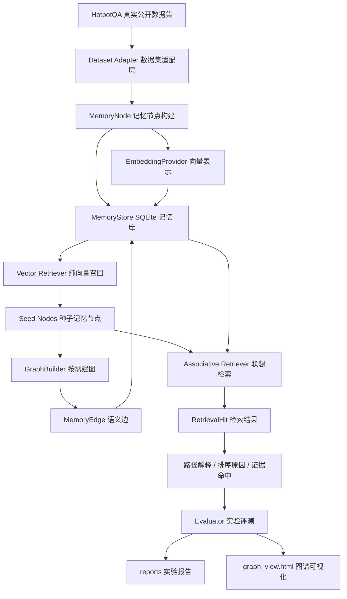

# SAM：语义联想记忆系统原型

本仓库对应硕士论文《基于语义联想机制的动态知识图谱记忆系统方法与实现》。当前阶段的目标不是一次性完成完整论文系统，而是在中期考核前做出一个可运行、可解释、可复现的最小原型，用真实代码和真实公开数据集支撑后续论文写作。

## 项目动机

传统 RAG 通常把文档切块后放入向量库，查询时按语义相似度取 top-k。这个方式简单有效，但在多跳问答、跨文档推理、长程科研阅读中容易漏掉证据链中的某一环：第一篇文档和问题很像，第二篇文档可能只和第一篇文档有关，和原始问题并不直接相似。

SAM 的思路是把历史知识表示为动态知识图谱中的记忆节点和语义边：

- 记忆节点保存文本、摘要、关键词、来源、时间戳、使用次数、置信度和 embedding。
- 语义边保存两个记忆节点之间的关系、边权和建边原因。
- 检索时先用向量相似度找到种子节点，再沿语义边进行联想扩展。
- 建图采用按需策略，不在写入阶段全量两两建边，而是在节点被检索激活后围绕种子节点补边。

这对应开题报告中的三条核心路线：动态演化的知识图谱记忆、基于语义关联路径的联想检索、多智能体共享记忆的底层支撑。

## 当前已经实现的内容

- Python 工程骨架：核心代码位于 `src/sam/`，脚本位于 `scripts/`，测试位于 `tests/`，中期材料位于 `docs/`。
- 本地记忆库：`MemoryStore` 使用 SQLite 保存记忆节点、语义边和检索日志。
- Embedding 抽象层：默认使用无需依赖的本地哈希 embedding，后续可通过环境变量切换到 OpenAI 兼容 embedding API。
- 按需建图：`GraphBuilder` 只围绕被激活的种子节点创建共享实体、关键词重叠、embedding 相似等语义边。
- 两阶段检索：`Retriever` 支持纯向量检索和“向量召回 + 图扩展”的联想检索。
- 真实数据实验：默认下载并使用 HotpotQA dev distractor 小样本。
- 可视化产物：自动生成 `reports/graph_view.html`、`reports/graph_artifact.json`、`reports/graph_mermaid.md`，可以直观看到节点、边和检索路径。

## 系统框架



## 目录结构

```text
SAM/
├── src/sam/
│   ├── datasets.py        # HotpotQA 下载、抽样和数据适配
│   ├── embedding.py       # embedding 抽象、本地哈希实现、OpenAI 兼容实现
│   ├── evaluator.py       # 实验评测与报告生成
│   ├── graph.py           # 按需建图逻辑
│   ├── models.py          # 记忆节点、语义边、检索结果等数据结构
│   ├── retriever.py       # 纯向量检索与联想图检索
│   ├── store.py           # SQLite 本地存储
│   ├── text.py            # 分词、关键词、相似度等文本工具
│   └── visualization.py   # 图谱 HTML/SVG、Mermaid、JSON 产物导出
├── scripts/
│   └── run_demo.py        # 端到端 demo 与实验入口
├── tests/
│   └── test_core.py       # 核心单元测试与集成测试
├── docs/
│   └── midterm_progress.md
├── reports/
│   ├── experiment_results.md
│   ├── experiment_results.json
│   ├── hotpotqa_sample_manifest.json
│   ├── graph_view.html
│   ├── graph_artifact.json
│   └── graph_mermaid.md
└── pyproject.toml
```

## 快速运行

所有命令都基于本地 conda 环境 `sam`：

```bash
conda run -n sam python scripts/run_demo.py --reset --dataset hotpotqa
```

运行后会生成以下产物：

- `reports/experiment_results.md`：实验表格与案例分析。
- `reports/experiment_results.json`：结构化实验结果。
- `reports/hotpotqa_sample_manifest.json`：真实 HotpotQA 抽样 ID、问题、答案、支持文档标题。
- `reports/graph_view.html`：可以直接打开查看的图谱 HTML/SVG 产物。
- `reports/graph_artifact.json`：图谱节点、边、检索案例的结构化产物。
- `reports/graph_mermaid.md`：Mermaid 版本图谱。
- `data/raw/hotpot_dev_distractor_v1.json`：HotpotQA 原始数据，已被 `.gitignore` 排除。
- `data/sam_demo.sqlite`：本地运行数据库，已被 `.gitignore` 排除。

运行测试：

```bash
conda run -n sam python -m unittest discover -s tests -v
```

## 实验数据集

当前主实验使用真实 HotpotQA dev distractor 数据。HotpotQA 是公开、经典的多跳问答数据集，问题需要跨多个 Wikipedia 段落推理，并提供 sentence-level supporting facts。

脚本会从 HotpotQA 官方地址下载 dev distractor 文件：

```text
http://curtis.ml.cmu.edu/datasets/hotpot/hotpot_dev_distractor_v1.json
```

当前快速实验不是全量评测，而是抽取一小批桥接型样本，用于快速验证图扩展机制：

| 项目 | 数量 |
| --- | ---: |
| 数据集 | HotpotQA dev distractor |
| 查询问题数 | 8 |
| 每个问题候选段落数 | 10 |
| 候选文档节点数量 | 80 |
| 每个问题 gold 支持证据数 | 2 |
| Gold 支持证据总数 | 16 |

抽样细节记录在 `reports/hotpotqa_sample_manifest.json`，可以检查每条样本的原始 HotpotQA ID、问题、答案、支持文档标题和抽样原因。

## 实验方法与指标

对比方法：

- 纯向量检索：对查询生成 embedding，在候选文档节点中按余弦相似度取 top-k。
- 联想图检索：先取向量种子节点，再围绕种子节点按需建边，并沿图扩展得到最终 top-k。

当前默认参数：

```text
top_k = 4
seed_k = 1
hops = 2
```

测试指标：

- 支持证据召回率：top-k 中命中的 gold supporting paragraph 数 / gold supporting paragraph 总数。
- 命中支持证据数：top-k 检索结果中命中的支持证据数量。
- 联想检索新增有效证据数：联想检索比纯向量检索多命中的支持证据数量。
- 联想路径长度：结果从种子节点扩展到目标节点的路径长度。

当前一次真实 HotpotQA 小样本实验结果：

| 指标 | 数值 |
| --- | ---: |
| 查询数量 | 8 |
| 候选文档节点数量 | 80 |
| Gold 支持证据数量 | 16 |
| 纯向量检索证据召回率 | 0.500 |
| 联想图检索证据召回率 | 0.625 |
| 纯向量命中支持证据数 | 8 |
| 联想检索命中支持证据数 | 10 |
| 联想检索新增有效证据数 | 2 |

这说明在当前真实 HotpotQA 小样本上，纯向量检索会漏掉部分间接相关的支持证据；联想图检索通过共享实体、关键词和语义相似边补回了部分证据链。

## 如何直观看到图

打开：

```text
reports/graph_view.html
```

黄色节点表示 HotpotQA 的 gold supporting paragraph，蓝色节点表示候选干扰段落，箭头表示系统实际创建的语义边。这个页面不是手工画图，而是由 `reports/graph_artifact.json` 自动渲染得到。

如果只想看图数据，可以查看：

```text
reports/graph_artifact.json
```

其中包含：

- `nodes`：每个记忆节点的标题、是否 supporting、关键词、实体和文本片段。
- `edges`：每条语义边的起点、终点、关系类型、权重和建边原因。
- `retrieval_cases`：每个问题下纯向量检索和联想图检索的结果、路径和是否命中 supporting facts。

## OpenAI / GPT API 接入方式

当前默认使用本地哈希 embedding，保证无依赖可跑。如果要使用 OpenAI 兼容 embedding API，可以设置：

```bash
export OPENAI_API_KEY="你的 key"
export SAM_EMBEDDING_PROVIDER="openai"
export SAM_OPENAI_EMBEDDING_MODEL="text-embedding-3-small"
conda run -n sam python scripts/run_demo.py --reset --dataset hotpotqa --embedding-provider openai
```

注意：API key 只从环境变量读取，绝不能写入仓库。

## 后续迭代方向

- 扩大真实 HotpotQA 样本规模，并接入 MultiHop-RAG、MuSiQue、2WikiMultiHopQA。
- 使用更强 embedding 模型替代本地哈希 embedding。
- 增强实体抽取和关系抽取，减少泛化关键词导致的噪声边。
- 增加路径质量、噪声扩展率、检索耗时等指标。
- 在多智能体场景中加入 Reading Agent、Summary Agent 的共享记忆读写接口。
