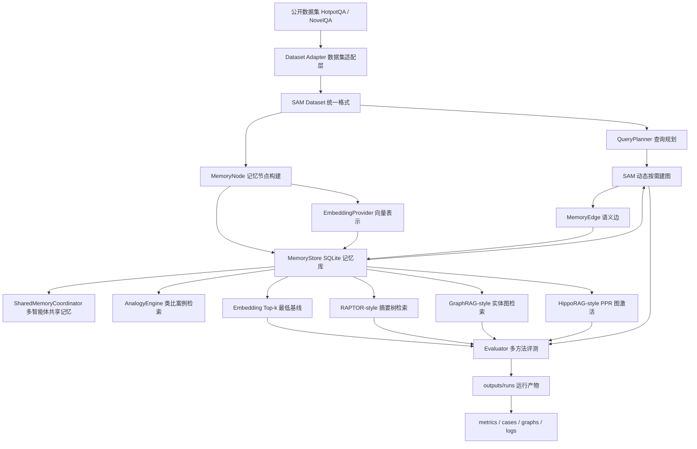

# SAM：语义联想记忆系统原型

本仓库对应硕士论文《基于语义联想机制的动态知识图谱记忆系统方法与实现》。当前阶段的目标是做出一个可运行、可解释、可复现的研究原型，用真实公开数据集和可检查的运行产物支撑中期考核与后续论文实现。

## 项目动机

传统 RAG 通常把文档切块后放入向量库，查询时按语义相似度取 top-k。这个方式简单有效，但在多跳问答、跨文档推理和长程阅读中容易漏掉证据链中的某一环：第一篇文档可能和问题很像，第二篇文档却只和第一篇文档有关，和原始问题并不直接相似。

SAM 的思路是把知识表示为动态知识图谱中的记忆节点和语义边：

- 记忆节点保存文本、摘要、关键词、来源、时间戳、使用次数、置信度和 embedding。
- 语义边保存两个记忆节点之间的关系、边权和建边原因。
- 检索时先用向量相似度找到种子节点，再沿语义边进行联想扩展。
- 建图采用按需策略，不在写入阶段全量两两建边，而是在节点被检索激活后围绕种子节点补边。

## 当前已经实现的内容

- Python 工程骨架：核心代码位于 `src/sam/`，脚本位于 `scripts/`，测试位于 `tests/`，中期材料位于 `docs/`。
- 系统设计文档：`docs/system_design.md` 记录后续项目设计、动态记忆机制和开发优先级。
- 本地记忆库：`MemoryStore` 使用 SQLite 保存记忆节点、语义边和检索日志。
- 动态记忆状态：每次检索会更新节点访问次数、最近访问时间、路径边激活次数和最近激活时间，并写入检索日志。
- 记忆重构与巩固：成功命中支持证据后，系统会生成 `consolidated_memory` 长期记忆节点，将问题、答案和支持证据沉淀为可复用经验，并反向更新原始证据节点。
- 巩固记忆复用：SAM 后续检索会把已有巩固记忆加入候选池，允许其作为联想路径中的中间节点，但不会让它直接占据最终证据 top-k。
- 按需建图解释：建边过程拆分为实体、关键词和语义相似 scorer，并在运行产物中输出 `graphs/edge_creation_log.json`。
- 边质量约束：对只依赖低信息关键词重叠的候选边进行过滤，避免联想扩展被泛化词噪声误导。
- 关系级建边判别：`GraphBuilder` 可选接入 GPT-5.4，对候选边做语义关系判断，过滤词面相似但关系无效的噪声边。
- 查询规划模块：`QueryPlanner` 可以在检索前生成任务感知的 `retrieval_query`，当前支持启发式规划和 GPT-5.4 规划入口，避免长文本多选题把全部干扰选项直接拼入检索文本。
- 状态感知多路径激活：SAM 检索会综合多条候选路径、边历史激活、节点使用频率和近期访问状态进行重排。
- Embedding 抽象层：默认使用无需依赖的本地哈希 embedding，也可切换到 OpenAI 或 Azure OpenAI 兼容 embedding API。
- 类比推理初版：`AnalogyEngine` 可以按历史案例检索相似记忆，并支持基于关系路径模式的案例匹配，生成可注入 LLM 的类比提示。
- 多智能体共享记忆初版：`SharedMemoryCoordinator` 提供全局洞察层、会话层和交互细节层的统一写入与查询接口，并支持智能体之间的定向 handoff 记忆；`MultiAgentResearchWorkflow` 可以运行 planner、retriever、writer、verifier 四角色协作流程。
- 多智能体共享记忆复用实验：`run_agent_memory_reuse_experiment.py` 可以读取连续记忆复用实验的 probe cases，统计 retriever 的证据交接是否被 writer 使用、writer 的答案交接是否被 verifier 使用，以及共享记忆链路是否承接了 SAM 相对 baseline 的证据增益。
- 多智能体生成对照实验：`run_agent_generation_experiment.py` 可以对比“无共享记忆”“共享记忆”“共享记忆+类比提示”三种答案生成设置，为后续 GPT-5.4 正式实验保留统一入口。
- 检索-生成闭环初版：`ContextAnswerGenerator` 可以基于 `cases.json` 中的检索上下文调用聊天模型生成答案，并支持从历史案例自动加入类比提示。
- Bad case 分析：每次实验自动输出 `bad_cases.json` 和 `bad_cases.md`，记录失败类型、诊断和架构改进建议。
- 数据集统一格式：外部数据集先转换成 `sam-dataset-v1`，核心系统不直接依赖 HotpotQA 或 NovelQA 原始格式。
- 多方法检索：支持 `embedding_topk`、`raptor_style`、`graphrag_style`、`hipporag_style` 和 `sam`。
- 官方 baseline 评测：`evaluation/official_baselines/` 提供 RAPTOR、Microsoft GraphRAG、HippoRAG 官方代码的下载、数据导出和运行入口；论文实验应优先使用这里的官方评测结果。
- 运行产物隔离：默认写入 `outputs/runs/<run_name>/`，该目录已被 `.gitignore` 排除。
- 可视化产物：HTML 页面可以按样本切换，纵向比较多种方法，并点击节点/边查看完整解释。

## 系统框架



## 目录结构

```text
SAM/
├── src/sam/
│   ├── datasets.py        # 公开数据集适配，包括 HotpotQA 和 NovelQA
│   ├── dataset_format.py  # SAM 统一数据格式读写
│   ├── agent_workflow.py  # 多智能体共享记忆协作流程
│   ├── agent_reuse_experiment.py # 多智能体共享记忆复用实验
│   ├── agents.py          # 多智能体共享记忆与定向 handoff
│   ├── analogy.py         # 类比推理案例检索、关系路径匹配与提示生成
│   ├── badcase.py         # 失败案例诊断和改进建议
│   ├── consolidation.py   # 成功检索后的长期记忆巩固与证据回写
│   ├── embedding.py       # embedding 抽象、本地哈希实现、OpenAI/Azure 兼容实现
│   ├── evaluator.py       # 多方法实验评测与报告生成
│   ├── generation.py      # 基于检索上下文的答案生成评测
│   ├── graph.py           # 按需建图逻辑
│   ├── llm.py             # GPT/Azure 聊天模型接口
│   ├── models.py          # 记忆节点、语义边、检索结果等数据结构
│   ├── query_planner.py   # 查询规划，支持启发式规划和 GPT-5.4 规划入口
│   ├── retriever.py       # 多方法检索器
│   ├── store.py           # SQLite 本地存储
│   ├── text.py            # 分词、关键词、相似度等文本工具
│   └── visualization.py   # 图谱 HTML/SVG、Mermaid、JSON 产物导出
├── scripts/
│   ├── generate_answers.py
│   ├── prepare_hotpotqa.py
│   ├── prepare_novelqa.py
│   ├── run_analogy_reuse_experiment.py
│   ├── run_agent_generation_experiment.py
│   ├── run_agent_memory_reuse_experiment.py
│   ├── run_end_to_end_experiment.py
│   ├── run_memory_reuse_experiment.py
│   ├── run_reranker_profile_experiment.py
│   ├── run_agent_workflow.py
│   └── run_demo.py
├── tests/
│   └── test_core.py
├── docs/
│   └── midterm_progress.md
├── evaluation/
│   └── official_baselines/ # 官方 baseline 评测适配
├── reports/               # 人工整理后的阶段材料，不再作为默认运行产物目录
└── outputs/               # 每次实验的运行产物，已被 .gitignore 排除
```

## 快速运行

所有命令都基于本地 conda 环境 `sam`：

```bash
conda run -n sam python scripts/prepare_hotpotqa.py --sample-size 8 --max-scan 800
conda run -n sam python scripts/run_demo.py --reset --dataset hotpotqa
```

SAM 的路径重排权重可以通过 `--reranker-profile` 切换，用于 bad case 后的消融实验。当前默认 profile 是 `semantic_heavy`，这是根据 HotpotQA 300 条 profile 对比实验确定的：它比原先的 `balanced` 取得了更高的证据召回率和答案命中率。

```bash
conda run -n sam python scripts/run_demo.py \
  --reset \
  --dataset hotpotqa \
  --methods embedding_topk,sam_full \
  --reranker-profile graph_heavy
```

当前支持 `balanced`、`semantic_heavy`、`graph_heavy`、`memory_heavy`。运行产物 `cases.json` 会在 SAM 命中结果中记录 `reranker_profile` 和对应 `score_breakdown`，便于分析某个失败样本是语义相似度不足、图路径噪声，还是历史记忆权重过强。`PathReranker` 还会对过密候选路径加入 `path_noise_penalty`，避免长文本场景中“路径很多但证据不可靠”的节点被无条件推高。

如果要一次性比较多个 profile，可以运行：

```bash
conda run -n sam python scripts/run_reranker_profile_experiment.py \
  --dataset-file data/processed/hotpotqa_sam_sample.json \
  --limit 30 \
  --profiles balanced,semantic_heavy,graph_heavy,memory_heavy \
  --run-name reranker_profile_hotpotqa30
```

该脚本会输出 `reranker_profile_comparison.json` 和 `reranker_profile_comparison.md`，包含每种 profile 的证据召回率、答案命中率、平均路径长度和 bad case 类型统计。

运行后会生成独立 run 目录，例如：

```text
outputs/runs/20260508_230000_hotpotqa/
├── config.json
├── dataset_summary.json
├── metrics.json
├── metrics.md
├── cases.json
├── graphs/
│   ├── graph_view.html
│   ├── graph_artifact.json
│   └── graph_mermaid.md
└── logs/
    └── run_summary.txt
```

运行测试：

```bash
conda run -n sam python -m unittest discover -s tests -v
```

运行检索、生成、答案判别和 bad case 分析的端到端实验：

```bash
conda run -n sam python scripts/run_end_to_end_experiment.py \
  --dataset-file data/processed/hotpotqa_sam_sample.json \
  --limit 8 \
  --retrieval-methods embedding_topk,sam_full \
  --generation-method sam_full \
  --chat-provider heuristic \
  --answer-judge rule \
  --query-planner heuristic \
  --relation-judge disabled \
  --reranker-profile semantic_heavy \
  --run-name end_to_end_hotpotqa8
```

该脚本会在同一个 run 目录中输出 `metrics.json`、`cases.json`、`generated_answers.json`、`generation_bad_cases.json` 和 `pipeline_summary.json`。正式实验可以把 `--chat-provider`、`--answer-judge`、`--query-planner` 和 `--relation-judge` 切换为 GPT-5.4 配置。

使用 Azure OpenAI embedding 时不要把 key 写入仓库，使用环境变量配置：

```bash
export SAM_EMBEDDING_PROVIDER=azure_openai
export SAM_AZURE_EMBEDDING_ENDPOINT="https://search-va.byteintl.net/gpt/openapi/online/v2/crawl"
export SAM_AZURE_EMBEDDING_API_VERSION="2023-07-01-preview"
export SAM_AZURE_EMBEDDING_MODEL="text-embedding-3-large"
export SAM_AZURE_EMBEDDING_DIMENSIONS="1024"
export SAM_AZURE_EMBEDDING_CONCURRENCY="10"
export SAM_AZURE_EMBEDDING_BATCH_SIZE="16"
export SAM_AZURE_EMBEDDING_API_KEY="..."

conda run -n sam python scripts/run_demo.py \
  --reset \
  --dataset hotpotqa \
  --embedding-provider azure_openai \
  --embedding-cache \
  --embedding-concurrency 10
```

`--embedding-cache` 会把向量缓存到 `data/embedding_cache.sqlite`，该文件已被 gitignore 排除。也可以用 `--embedding-cache-path outputs/runs/<run_name>/embedding_cache.sqlite` 把缓存放进某次实验目录。

在线 embedding provider 会按 `SAM_AZURE_EMBEDDING_BATCH_SIZE` 分批请求，并按 `SAM_AZURE_EMBEDDING_CONCURRENCY` 并发处理不同 batch。默认 payload 会同时发送 `model` 和 `dimensions`，适配公司网关；如果你的 Azure 标准部署不接受 body 中的 `model` 字段，可以设置：

```bash
export SAM_AZURE_EMBEDDING_SEND_MODEL="0"
```

正式跑实验前，建议先用诊断脚本检查配置。默认只检查环境变量，不会发请求：

```bash
conda run -n sam python scripts/check_embedding_provider.py \
  --provider azure_openai
```

如果要确认接口实际可用，可以显式增加 `--probe`。脚本只输出向量维度和范数，不打印向量内容、API key 或 endpoint 明文：

```bash
conda run -n sam python scripts/check_embedding_provider.py \
  --provider azure_openai \
  --probe "SAM embedding connectivity test."
```

如果公司网关不是标准 Azure deployment 拼接路径，也可以直接配置完整 embeddings 请求地址：

```bash
export SAM_AZURE_EMBEDDING_URL="https://你的完整/embeddings/请求地址"
```

设置 `SAM_AZURE_EMBEDDING_URL` 后，系统会优先使用该地址；否则使用 `SAM_AZURE_EMBEDDING_ENDPOINT`、`SAM_AZURE_EMBEDDING_MODEL` 和 `SAM_AZURE_EMBEDDING_API_VERSION` 拼接请求地址。

如果要使用 GPT-5.4 对候选语义边进行关系级判别，先配置聊天模型环境变量，然后在实验命令中增加 `--relation-judge gpt54`：

```bash
export SAM_CHAT_PROVIDER=azure_openai
export SAM_AZURE_CHAT_ENDPOINT="https://你的公司网关地址"
export SAM_AZURE_CHAT_API_VERSION="2024-02-01"
export SAM_AZURE_CHAT_MODEL="gpt-5.4-2026-03-05"
export SAM_AZURE_CHAT_API_KEY="..."

conda run -n sam python scripts/run_demo.py \
  --reset \
  --dataset hotpotqa \
  --dataset-file data/processed/hotpotqa_sam_sample.json \
  --methods embedding_topk,sam_full \
  --relation-judge gpt54
```

如果数据集提供了 `metadata.retrieval_query`，可以显式启用扩展检索文本：

```bash
conda run -n sam python scripts/run_demo.py \
  --dataset novelqa \
  --dataset-file data/processed/novelqa_demo_eval_sam_sample.json \
  --use-retrieval-query
```

该参数默认关闭。NovelQA adapter 当前生成的是启发式 query plan：保留原问题、问题关键词、Aspect 和 Complexity，不再把所有选项答案直接拼入检索查询。NovelQA 12 条 demonstration smoke run 显示，query plan 比全量 options 拼接更稳定，但仍不适合作为主实验默认策略；它应作为 query expansion 消融变量单独报告。

也可以使用运行时查询规划器。该方式不依赖数据集文件中是否提前保存了 `metadata.retrieval_query`，并且会把每条样本的规划结果写入 `cases.json` 的 `query_plan` 字段：

```bash
conda run -n sam python scripts/run_demo.py \
  --reset \
  --dataset novelqa \
  --dataset-file data/processed/novelqa_demo_eval_sam_sample.json \
  --methods embedding_topk,sam \
  --query-planner heuristic
```

如果要用 GPT-5.4 做查询规划，先按聊天模型环境变量配置 API，再把参数改为 `--query-planner gpt54`。当 `--query-planner` 和 `--use-retrieval-query` 同时出现时，运行时 query planner 的输出优先。

如果公司网关不是标准 Azure 路径，可以直接设置完整请求地址：

```bash
export SAM_AZURE_CHAT_URL="https://你的完整 chat/completions 地址"
```

使用 GPT-5.4 生成答案时同样使用环境变量配置，不把 key 写入仓库：

```bash
export SAM_CHAT_PROVIDER=azure_openai
export SAM_AZURE_CHAT_ENDPOINT="https://aidp-i18ntt-sg.byteintl.net/api/modelhub/online/v2/crawl"
export SAM_AZURE_CHAT_API_VERSION="2024-02-01"
export SAM_AZURE_CHAT_MODEL="gpt-5.4-2026-03-05"
export SAM_AZURE_CHAT_API_KEY="..."

conda run -n sam python scripts/generate_answers.py \
  --cases-file outputs/runs/<run_name>/cases.json \
  --method sam_full \
  --chat-provider azure_openai \
  --answer-judge gpt54
```

`--answer-judge` 控制答案命中判别方式。默认 `rule` 使用本地规则和关键内容词覆盖；`gpt54` 会调用聊天模型判断生成答案是否与标准答案语义等价，并把结构化判别结果写入 `generated_answers.json` 的 `answer_judgment` 字段。

生成脚本还会自动输出 `generation_bad_cases.json` 和 `generation_bad_cases.md`，用于区分“检索上下文不足”和“上下文已有但生成答案未通过判别”两类问题。

如果要评测类比提示对答案生成的影响，可以在同一份 `cases.json` 上增加：

```bash
conda run -n sam python scripts/generate_answers.py \
  --cases-file outputs/runs/<run_name>/cases.json \
  --method sam_full \
  --chat-provider azure_openai \
  --use-analogy-hints \
  --analogy-top-k 2 \
  --output-dir outputs/runs/<run_name>/generated_with_analogy
```

也可以直接生成“无类比提示 vs 有类比提示”的对照报告：

```bash
conda run -n sam python scripts/generate_answers.py \
  --cases-file outputs/runs/<run_name>/cases.json \
  --method sam_full \
  --chat-provider azure_openai \
  --compare-analogy \
  --analogy-top-k 2 \
  --output-dir outputs/runs/<run_name>/generation_comparison
```

该命令会输出 `generation_comparison.json` 和 `generation_comparison.md`，记录两种生成方式的答案命中率、差值和逐样本变化。

运行多智能体共享记忆协作实验：

```bash
conda run -n sam python scripts/run_agent_workflow.py \
  --cases-file outputs/runs/<run_name>/cases.json \
  --method sam_full \
  --chat-provider azure_openai \
  --output-dir outputs/runs/<run_name>/agent_workflow
```

该命令会输出 `agent_workflow.json` 和 `agent_workflow.md`，记录 planner、retriever、writer、verifier 的步骤、共享记忆节点、writer 使用的记忆和 verifier 验证结果。

运行多智能体共享记忆复用实验：

```bash
conda run -n sam python scripts/run_agent_memory_reuse_experiment.py \
  --cases-file outputs/runs/memory_reuse_hotpotqa30/memory_reuse_results.json \
  --method sam_no_feedback \
  --baseline-method embedding_topk \
  --output-dir outputs/runs/agent_memory_reuse_hotpotqa30
```

该命令会输出 `agent_memory_reuse_results.json` 和 `agent_memory_reuse_results.md`。当前 30 条 HotpotQA 连续记忆复用实验中，SAM 相对 Embedding Top-k 的支持证据增益总数为 31，22 条样本形成了 retriever、writer、verifier 之间的有效共享记忆链路，链路成功率为 0.733。这个实验对应开题报告中的“多智能体语义记忆共享结构”，重点验证中间证据和历史经验能否跨角色传递。

运行多智能体共享记忆生成对照实验：

```bash
conda run -n sam python scripts/run_agent_generation_experiment.py \
  --cases-file outputs/runs/memory_reuse_hotpotqa30/memory_reuse_results.json \
  --method sam_no_feedback \
  --output-dir outputs/runs/agent_generation_hotpotqa30_smoke
```

该命令会输出 `agent_generation_comparison.json` 和 `agent_generation_comparison.md`，对比 `baseline`、`shared_memory`、`shared_memory_with_analogy` 三种设置。默认本地启发式生成器只用于检查链路和产物格式；正式答案质量实验应增加 `--chat-provider azure_openai` 并配置 GPT-5.4 环境变量。

运行连续记忆复用实验：

```bash
conda run -n sam python scripts/run_memory_reuse_experiment.py \
  --dataset-file data/processed/hotpotqa_sam_sample.json \
  --run-name memory_reuse_hotpotqa30 \
  --limit 30
```

该实验先用 SAM warmup 生成巩固记忆，再在 probe 阶段移除候选集中的 gold 支持文档，验证系统能否通过历史巩固记忆把证据补回来。结果写入 `memory_reuse_results.json` 和 `memory_reuse_results.md`。

运行类比复用实验：

```bash
conda run -n sam python scripts/run_analogy_reuse_experiment.py \
  --dataset-file data/processed/hotpotqa_sam_sample.json \
  --run-name analogy_reuse_hotpotqa30 \
  --limit 30
```

该实验同样先 warmup 生成巩固记忆，再用 masked probe 查询类比检索历史案例，统计是否命中对应的巩固案例以及是否覆盖真实支持证据。

## 数据集

### HotpotQA

当前主实验使用真实 HotpotQA dev distractor 数据。HotpotQA 是经典多跳问答数据集，问题需要跨多个 Wikipedia 段落推理，并提供 supporting facts。脚本会下载并缓存原始文件到 `data/raw/`，该目录不会提交到 Git。

```bash
conda run -n sam python scripts/prepare_hotpotqa.py \
  --sample-size 8 \
  --max-scan 800
```

### NovelQA

NovelQA 是面向超长小说文本问答的公开基准，Hugging Face 页面需要用户登录并同意访问条件。本仓库不会自动下载或提交 NovelQA 原始小说文本；你需要先把 zip 或解压目录放到本地，例如：

```text
data/raw/NovelQA/
```

然后运行：

```bash
conda run -n sam python scripts/prepare_novelqa.py \
  --source data/raw/NovelQA \
  --output data/processed/novelqa_sam_sample.json \
  --sample-size 8 \
  --max-books 1
```

NovelQA 适配策略：

- 小说正文按固定窗口切成 memory document。
- 每个 QA 样本保留 `QID`、`Aspect`、`Complexity`、`Question`、`Options` 和原始答案字段。
- 真实 `NovelQA.zip` 中的 `Data/PublicDomain/*.json` 通常是 `{QID: {...}}` 字典结构，适配器已经兼容这种格式。
- 每个问题的候选文档来自同一本小说的 chunk 集合。
- 如果样本没有可映射到 chunk 的 gold evidence 或 gold answer，则不计算 evidence recall，答案命中率也不会把选项 A 之类的占位值误当成标准答案。

如果你需要在 NovelQA 上看到真实分数，应优先使用 zip 中自带的 demonstration 子集，因为 `Demonstration/Frankenstein.json` 包含 `Answer`、`Gold` 和 `Evidences`：

```bash
conda run -n sam python scripts/prepare_novelqa.py \
  --source data/raw/NovelQA.zip \
  --output data/processed/novelqa_demo_sam_sample.json \
  --split demonstration \
  --sample-size 8

conda run -n sam python scripts/run_demo.py \
  --reset \
  --dataset novelqa \
  --dataset-file data/processed/novelqa_demo_sam_sample.json \
  --novelqa-source data/raw/NovelQA.zip \
  --novelqa-split demonstration
```

## SAM 项目统一数据格式

外部数据集不能直接进入记忆系统，必须先由专门脚本转换成 SAM 统一格式。统一格式顶层结构：

```json
{
  "schema_version": "sam-dataset-v1",
  "dataset_info": {
    "name": "HotpotQA dev distractor"
  },
  "processing": {
    "source_script": "scripts/prepare_hotpotqa.py"
  },
  "documents": [],
  "queries": []
}
```

`documents` 是待写入记忆系统的文档节点原料，`queries` 是评测查询。`queries.metadata` 会保存 NovelQA 的选项、题型、小说 ID 等数据集特有信息。

## 实验方法与指标

对比方法：

- `embedding_topk`：最低基线，只按查询和文档 embedding 的相似度取 top-k。
- `raptor_style`：模拟 RAPTOR 的摘要树思想，先把 chunk 聚成语义簇，再综合簇摘要和叶子 chunk 得分。
- `graphrag_style`：模拟 GraphRAG 的实体图局部检索思想，结合实体/关键词命中、局部图邻域和文本相似度。
- `hipporag_style`：模拟 HippoRAG 的 KG + Personalized PageRank 思想，以查询相似度作为先验，在图上做节点激活传播。
- `sam`：先用 embedding 激活种子记忆，再围绕种子按需建图，并结合语义路径、节点使用频率、置信度重排。
- `sam_vector_anchor`：SAM 的 bad case 改进实验模式，保留更多初始向量候选，避免噪声图路径把有效直接证据挤出 top-k。
- `sam_adaptive_anchor`：根据扩展路径支持分动态决定是否保留更多向量候选，并在 `cases.json` 中记录触发原因。

这些 `*-style` 方法是论文思想级对照，不声称复现官方完整实现。这样命名是为了保证实验表述诚实。

测试指标：

- 支持证据召回率：top-k 中命中的 gold supporting paragraph 数 / gold supporting paragraph 总数。
- 命中支持证据数：top-k 检索结果中命中的支持证据数量。
- 答案命中率：top-k 检索文本中是否覆盖标准答案或标准选项文本。
- SAM 平均路径长度：SAM 结果从种子节点扩展到目标节点的路径长度。

一次 HotpotQA 小样本 smoke run 的结果示例：

| 方法 | 证据召回率 | 答案命中率 |
| --- | ---: | ---: |
| Embedding Top-k | 0.500 | 0.375 |
| RAPTOR-style | 0.688 | 0.625 |
| GraphRAG-style | 0.562 | 0.500 |
| HippoRAG-style | 0.562 | 0.500 |
| SAM 动态联想检索 | 0.625 | 0.625 |

## 如何直观看到图

打开最新 run 目录中的：

```text
outputs/runs/<run_name>/graphs/graph_view.html
```

图谱页面支持交互：

- 点击节点：右侧详情面板显示完整 `MemoryNode`，包括标题、完整文本、summary、keywords、tags、confidence 和 metadata。
- 点击边：右侧详情面板显示关系类型、边权、建边原因和完整 `MemoryEdge`。
- 切换样本：顶部下拉框可以按样本切换，不需要每次重新运行实验。
- 方法对比：同一条样本下纵向展示多种方法的检索图，便于观察 SAM 如何选择和扩展节点。
