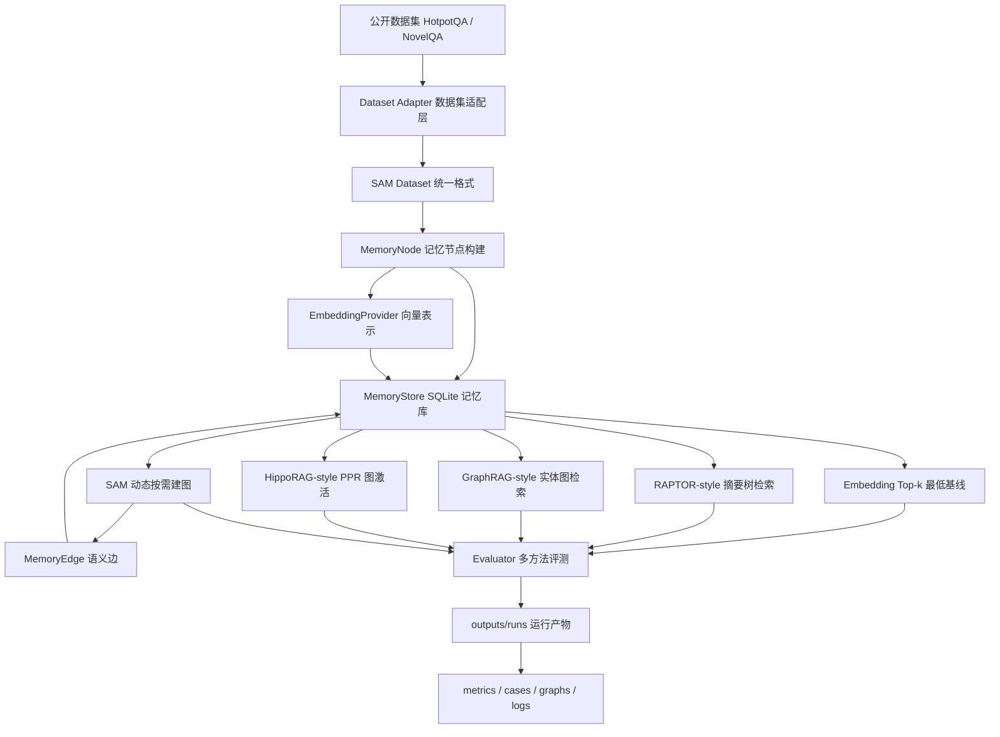

# SAM：语义联想记忆系统原型

本仓库对应硕士论文《基于语义联想机制的动态知识图谱记忆系统方法与实现》。当前阶段的目标是做出一个可运行、可解释、可复现的研究原型，用真实公开数据集和可检查的运行产物支撑中期考核与后续论文实现。

## 项目动机

传统 RAG 通常把文档切块后放入向量库，查询时按语义相似度取 top-k。这个方式简单有效，但在多跳问答、跨文档推理和长程阅读中容易漏掉证据链中的某一环：第一篇文档可能和问题很像，第二篇文档却只和第一篇文档有关，和原始问题并不直接相似。

SAM 的思路是把知识表示为动态知识图谱中的记忆节点和语义边：

- 记忆节点保存文本、摘要、关键词、来源、时间戳、使用次数、置信度和 embedding。
- 语义边保存两个记忆节点之间的关系、边权和建边原因。
- 检索时先用向量相似度找到种子节点，再沿语义边进行联想扩展。
- 建图采用按需策略，不在写入阶段全量两两建边，而是在节点被检索激活后围绕种子节点补边。

## 当前已经实现的内容

- Python 工程骨架：核心代码位于 `src/sam/`，脚本位于 `scripts/`，测试位于 `tests/`，中期材料位于 `docs/`。
- 系统设计文档：`docs/system_design.md` 记录后续项目设计、动态记忆机制和开发优先级。
- 本地记忆库：`MemoryStore` 使用 SQLite 保存记忆节点、语义边和检索日志。
- Embedding 抽象层：默认使用无需依赖的本地哈希 embedding，后续可切换到 OpenAI 兼容 embedding API。
- 数据集统一格式：外部数据集先转换成 `sam-dataset-v1`，核心系统不直接依赖 HotpotQA 或 NovelQA 原始格式。
- 多方法检索：支持 `embedding_topk`、`raptor_style`、`graphrag_style`、`hipporag_style` 和 `sam`。
- 官方 baseline 评测：`evaluation/official_baselines/` 提供 RAPTOR、Microsoft GraphRAG、HippoRAG 官方代码的下载、数据导出和运行入口；论文实验应优先使用这里的官方评测结果。
- 运行产物隔离：默认写入 `outputs/runs/<run_name>/`，该目录已被 `.gitignore` 排除。
- 可视化产物：HTML 页面可以按样本切换，纵向比较多种方法，并点击节点/边查看完整解释。

## 系统框架



## 目录结构

```text
SAM/
├── src/sam/
│   ├── datasets.py        # 公开数据集适配，包括 HotpotQA 和 NovelQA
│   ├── dataset_format.py  # SAM 统一数据格式读写
│   ├── embedding.py       # embedding 抽象、本地哈希实现、OpenAI 兼容实现
│   ├── evaluator.py       # 多方法实验评测与报告生成
│   ├── graph.py           # 按需建图逻辑
│   ├── models.py          # 记忆节点、语义边、检索结果等数据结构
│   ├── retriever.py       # 多方法检索器
│   ├── store.py           # SQLite 本地存储
│   ├── text.py            # 分词、关键词、相似度等文本工具
│   └── visualization.py   # 图谱 HTML/SVG、Mermaid、JSON 产物导出
├── scripts/
│   ├── prepare_hotpotqa.py
│   ├── prepare_novelqa.py
│   └── run_demo.py
├── tests/
│   └── test_core.py
├── docs/
│   └── midterm_progress.md
├── evaluation/
│   └── official_baselines/ # 官方 baseline 评测适配
├── reports/               # 人工整理后的阶段材料，不再作为默认运行产物目录
└── outputs/               # 每次实验的运行产物，已被 .gitignore 排除
```

## 快速运行

所有命令都基于本地 conda 环境 `sam`：

```bash
conda run -n sam python scripts/prepare_hotpotqa.py --sample-size 8 --max-scan 800
conda run -n sam python scripts/run_demo.py --reset --dataset hotpotqa
```

运行后会生成独立 run 目录，例如：

```text
outputs/runs/20260508_230000_hotpotqa/
├── config.json
├── dataset_summary.json
├── metrics.json
├── metrics.md
├── cases.json
├── graphs/
│   ├── graph_view.html
│   ├── graph_artifact.json
│   └── graph_mermaid.md
└── logs/
    └── run_summary.txt
```

运行测试：

```bash
conda run -n sam python -m unittest discover -s tests -v
```

## 数据集

### HotpotQA

当前主实验使用真实 HotpotQA dev distractor 数据。HotpotQA 是经典多跳问答数据集，问题需要跨多个 Wikipedia 段落推理，并提供 supporting facts。脚本会下载并缓存原始文件到 `data/raw/`，该目录不会提交到 Git。

```bash
conda run -n sam python scripts/prepare_hotpotqa.py \
  --sample-size 8 \
  --max-scan 800
```

### NovelQA

NovelQA 是面向超长小说文本问答的公开基准，Hugging Face 页面需要用户登录并同意访问条件。本仓库不会自动下载或提交 NovelQA 原始小说文本；你需要先把 zip 或解压目录放到本地，例如：

```text
data/raw/NovelQA/
```

然后运行：

```bash
conda run -n sam python scripts/prepare_novelqa.py \
  --source data/raw/NovelQA \
  --output data/processed/novelqa_sam_sample.json \
  --sample-size 8 \
  --max-books 1
```

NovelQA 适配策略：

- 小说正文按固定窗口切成 memory document。
- 每个 QA 样本保留 `QID`、`Aspect`、`Complexity`、`Question`、`Options` 和原始答案字段。
- 真实 `NovelQA.zip` 中的 `Data/PublicDomain/*.json` 通常是 `{QID: {...}}` 字典结构，适配器已经兼容这种格式。
- 每个问题的候选文档来自同一本小说的 chunk 集合。
- 如果样本没有可映射到 chunk 的 gold evidence 或 gold answer，则不计算 evidence recall，答案命中率也不会把选项 A 之类的占位值误当成标准答案。

如果你需要在 NovelQA 上看到真实分数，应优先使用 zip 中自带的 demonstration 子集，因为 `Demonstration/Frankenstein.json` 包含 `Answer`、`Gold` 和 `Evidences`：

```bash
conda run -n sam python scripts/prepare_novelqa.py \
  --source data/raw/NovelQA.zip \
  --output data/processed/novelqa_demo_sam_sample.json \
  --split demonstration \
  --sample-size 8

conda run -n sam python scripts/run_demo.py \
  --reset \
  --dataset novelqa \
  --dataset-file data/processed/novelqa_demo_sam_sample.json \
  --novelqa-source data/raw/NovelQA.zip \
  --novelqa-split demonstration
```

## SAM 项目统一数据格式

外部数据集不能直接进入记忆系统，必须先由专门脚本转换成 SAM 统一格式。统一格式顶层结构：

```json
{
  "schema_version": "sam-dataset-v1",
  "dataset_info": {
    "name": "HotpotQA dev distractor"
  },
  "processing": {
    "source_script": "scripts/prepare_hotpotqa.py"
  },
  "documents": [],
  "queries": []
}
```

`documents` 是待写入记忆系统的文档节点原料，`queries` 是评测查询。`queries.metadata` 会保存 NovelQA 的选项、题型、小说 ID 等数据集特有信息。

## 实验方法与指标

对比方法：

- `embedding_topk`：最低基线，只按查询和文档 embedding 的相似度取 top-k。
- `raptor_style`：模拟 RAPTOR 的摘要树思想，先把 chunk 聚成语义簇，再综合簇摘要和叶子 chunk 得分。
- `graphrag_style`：模拟 GraphRAG 的实体图局部检索思想，结合实体/关键词命中、局部图邻域和文本相似度。
- `hipporag_style`：模拟 HippoRAG 的 KG + Personalized PageRank 思想，以查询相似度作为先验，在图上做节点激活传播。
- `sam`：先用 embedding 激活种子记忆，再围绕种子按需建图，并结合语义路径、节点使用频率、置信度重排。

这些 `*-style` 方法是论文思想级对照，不声称复现官方完整实现。这样命名是为了保证实验表述诚实。

测试指标：

- 支持证据召回率：top-k 中命中的 gold supporting paragraph 数 / gold supporting paragraph 总数。
- 命中支持证据数：top-k 检索结果中命中的支持证据数量。
- 答案命中率：top-k 检索文本中是否覆盖标准答案或标准选项文本。
- SAM 平均路径长度：SAM 结果从种子节点扩展到目标节点的路径长度。

一次 HotpotQA 小样本 smoke run 的结果示例：

| 方法 | 证据召回率 | 答案命中率 |
| --- | ---: | ---: |
| Embedding Top-k | 0.500 | 0.375 |
| RAPTOR-style | 0.688 | 0.625 |
| GraphRAG-style | 0.562 | 0.500 |
| HippoRAG-style | 0.562 | 0.500 |
| SAM 动态联想检索 | 0.625 | 0.625 |

## 如何直观看到图

打开最新 run 目录中的：

```text
outputs/runs/<run_name>/graphs/graph_view.html
```

图谱页面支持交互：

- 点击节点：右侧详情面板显示完整 `MemoryNode`，包括标题、完整文本、summary、keywords、tags、confidence 和 metadata。
- 点击边：右侧详情面板显示关系类型、边权、建边原因和完整 `MemoryEdge`。
- 切换样本：顶部下拉框可以按样本切换，不需要每次重新运行实验。
- 方法对比：同一条样本下纵向展示多种方法的检索图，便于观察 SAM 如何选择和扩展节点。
