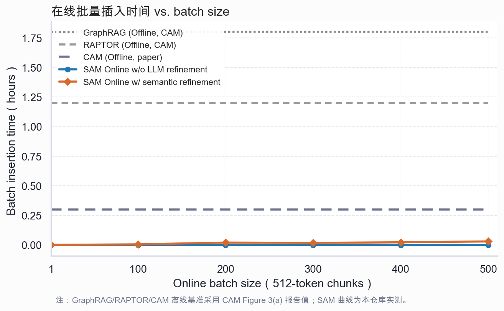

# CAM 口径在线插入时间实验

## 实验目的

本实验复用 CAM Figure 3(a) 的问题口径：当系统在线接收一批新的文本 chunk 时，完成记忆写入、局部结构更新和高层语义压缩需要多少时间。

该实验用于回答“低成本体现在哪里”。SAM 的主张不是不使用 LLM，而是把 LLM 从底层全量建边中移出，只用于高层语义压缩和查询阶段推理。因此实验同时比较：

- `SAM Online w/o LLM refinement`：只统计写入和非 LLM 局部建图。
- `SAM Online w/ semantic refinement`：在上一项基础上加入 GPT-5.2 高层语义压缩。

GraphRAG、RAPTOR 和 CAM offline 曲线使用 CAM Figure 3(a) 中报告的离线重建时间作为引用基准。

## 实验图



## 实验设置

数据使用 `data/processed/litsearch_query30_sam_sample.json`，包含 630 个论文摘要 memory items 和 30 个查询。CAM 原实验中每个 chunk 为 512 tokens；本实验脚本保留 `chunk_token_size=512` 作为对齐口径，同时在结果中记录当前数据文件的实际 token 统计：平均 189.81 tokens，最大 1845 tokens，最小 47 tokens。

在线 batch size 设置为 `1,100,200,300,400,500`。低层建边策略为 `sam_context`，只在查询候选集合内做局部建边，不做全量两两建图。高层语义压缩每 20 个 memory items 聚合一次，使用 GPT-5.2，输出上限为 120 tokens。

运行命令：

```bash
conda run --no-capture-output -n sam python scripts/run_cam_style_insertion_experiment.py \
  --env-file .env.local \
  --dataset-file data/processed/litsearch_query30_sam_sample.json \
  --batch-sizes 1,100,200,300,400,500 \
  --repeats 1 \
  --compression-group-size 20 \
  --compressor-mode llm \
  --chat-provider azure_openai_sdk \
  --llm-max-tokens 120 \
  --output-dir outputs/cam_style_insertion_litsearch_gpt52 \
  --figure-png docs/figures/sam_cam_style_insertion_time_gpt52.png \
  --figure-svg docs/figures/sam_cam_style_insertion_time_gpt52.svg \
  --figure-data docs/figures/sam_cam_style_insertion_time_gpt52_data.json
```

## 关键结果

在 batch size 为 500 时：

- SAM 不含 LLM 高层压缩的在线插入耗时为 0.164 秒。
- SAM 加入 GPT-5.2 高层语义压缩后的在线插入耗时为 110.125 秒，即 0.0306 小时。
- 相比 CAM 图中 GraphRAG offline 的 1.8 小时，SAM 加高层语义压缩后约快 58.8 倍。
- 相比 CAM 图中 RAPTOR offline 的 1.2 小时，SAM 加高层语义压缩后约快 39.2 倍。
- 同一 batch 下低层局部建边只比较 8588 个候选边对，产生 336 条边。

这说明 SAM 的低成本主要来自两点：第一，新记忆进入系统时不触发全局重建；第二，LLM 只用于高层语义压缩，其调用次数按压缩组数量增长，而不是按节点两两组合增长。

## 结果解释

GraphRAG 和 RAPTOR 的离线基准在在线场景下需要重建全局结构，因此时间是小时级。SAM 的底层图更新是局部的，耗时在秒以下；加入 GPT-5.2 后，主要成本来自高层摘要调用，但 500 个 memory items 的完整处理仍在约 2 分钟内完成。

当前曲线中 200 和 300 batch 的 LLM refinement 时间存在轻微非单调波动，这是在线 API 响应延迟造成的。后续如果要做论文最终版实验，应在固定 API 并发和重试策略后重复多轮取中位数，或者将 LLM 压缩调用拆分为并发版本和串行版本分别报告。
