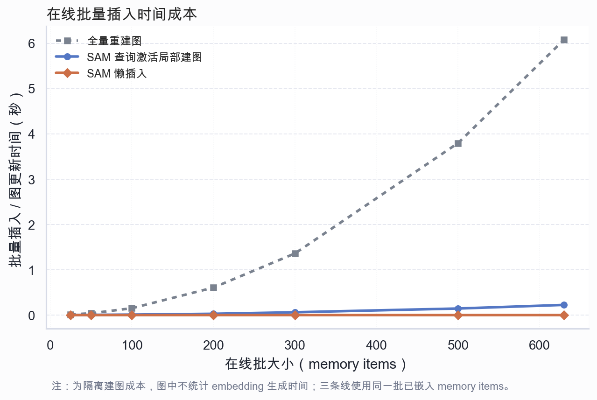
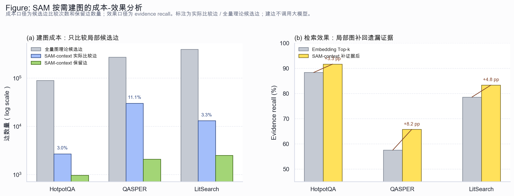

# 图联想补证据实验

## 实验目的

此前的建图策略实验把图扩展结果直接混入最终 top-k 排序，结果显示朴素图扩展不一定优于 embedding 检索。这个实验改用更符合 SAM 定位的口径：固定保留 embedding top-k，不让图结果替换原始检索结果，只统计图能否从已激活的 seed 证据出发，额外补回 embedding 漏掉的 gold evidence。

因此，本实验回答的问题不是“图是否全面替代 embedding”，而是“当 embedding 已经命中部分证据时，语义联想图能否补全遗漏证据链”。

## 实验设置

检索流程如下：

1. 对 query 和候选文档生成 embedding。
2. 使用 embedding top-k 得到 baseline 证据集合。
3. 从 baseline 中前 `seed-k` 个节点出发做图扩展。
4. 图扩展结果不替换 baseline，只作为额外候选。
5. 统计额外候选中有多少是 baseline 漏掉的 gold evidence。

核心指标包括：

- Baseline Recall：embedding top-k 的 evidence recall。
- Rescue 后 Recall：embedding top-k 加上图补回证据后的 evidence recall。
- Recall 增益：Rescue 后 Recall 减去 Baseline Recall。
- 可补证据 Query：baseline 至少命中一个 gold evidence、同时还漏掉其他 gold evidence 的 query。
- 图补回证据数：图扩展额外补回的 gold evidence 数量。
- 图补证据成功率：成功补回证据的 query 数 / 可补证据 query 数。
- 对遗漏证据的补回率：补回证据数 / 可补证据 query 中 baseline 漏掉的 gold evidence 数。
- 图扩展 Precision：补回证据数 / 图额外扩展节点数。

## 运行命令

HotpotQA bridge-style 30 条：

```bash
SAM_EMBEDDING_CACHE_WRITE_BATCH_SIZE=200 \
conda run --no-capture-output -n sam python -u scripts/run_evidence_rescue_experiment.py \
  --dataset-file data/processed/hotpotqa_midterm30_sam_sample.json \
  --limit-queries 30 \
  --embedding-provider azure_openai_sdk \
  --embedding-concurrency 20 \
  --embedding-input-mode single \
  --embedding-cache \
  --embedding-cache-path outputs/evidence_rescue_hotpotqa30/embedding_cache.sqlite \
  --context-path-policy intrinsic \
  --pair-scope query_candidates \
  --top-k 5 \
  --seed-k 2 \
  --hops 1 \
  --top-k-edges 4 \
  --threshold 0.18 \
  --alpha 0.55 \
  --output-dir outputs/evidence_rescue_hotpotqa30
```

QASPER 30 条：

```bash
SAM_EMBEDDING_CACHE_WRITE_BATCH_SIZE=200 \
conda run --no-capture-output -n sam python -u scripts/run_evidence_rescue_experiment.py \
  --dataset-file data/processed/qasper_validation30_sam_sample.json \
  --limit-queries 30 \
  --embedding-provider azure_openai_sdk \
  --embedding-concurrency 20 \
  --embedding-input-mode single \
  --embedding-cache \
  --embedding-cache-path outputs/graph_strategy_experiment_qasper30/embedding_cache.sqlite \
  --context-path-policy metadata \
  --pair-scope query_candidates \
  --top-k 5 \
  --seed-k 2 \
  --hops 1 \
  --top-k-edges 4 \
  --threshold 0.18 \
  --alpha 0.55 \
  --output-dir outputs/evidence_rescue_qasper30
```

LitSearch 30 条：

```bash
SAM_EMBEDDING_CACHE_WRITE_BATCH_SIZE=200 \
conda run --no-capture-output -n sam python -u scripts/run_evidence_rescue_experiment.py \
  --dataset-file data/processed/litsearch_query30_sam_sample.json \
  --limit-queries 30 \
  --embedding-provider azure_openai_sdk \
  --embedding-concurrency 20 \
  --embedding-input-mode single \
  --embedding-cache \
  --embedding-cache-path outputs/graph_strategy_experiment_litsearch30/embedding_cache.sqlite \
  --context-path-policy intrinsic \
  --pair-scope query_candidates \
  --top-k 5 \
  --seed-k 2 \
  --hops 1 \
  --top-k-edges 4 \
  --threshold 0.18 \
  --alpha 0.55 \
  --output-dir outputs/evidence_rescue_litsearch30
```

## 实验结果

### 在线插入时间成本图



这张图对应 CAM Figure 3(a) 的问题口径：当系统在线接收一批新记忆时，插入和建图更新时间如何随 batch size 增长。

实验使用 LitSearch 30 条查询中的 630 个论文摘要 memory items。为隔离建图策略本身的成本，图中不统计 embedding 生成时间，三条线使用同一批已经完成 embedding 的 memory items。对每个 batch size 重复计时 3 次并取中位数。

对比三种策略：

- 全量重建图：每次新 batch 到来后，对当前全部 memory items 做全局两两比较并重建图。
- SAM 查询激活局部建图：只围绕当前查询涉及的候选 memory items 建局部边。
- SAM 懒插入：新 memory item 先写入记忆库，不在插入时立即建边，等查询激活后再局部补边。

实测结果显示，在 630 个 memory items 时，全量重建图需要 6.077 秒，需要比较 396270 个候选边对；SAM 查询激活局部建图需要 0.222 秒，只比较 13100 个候选边对，相比全量重建约快 27.4 倍；SAM 懒插入在插入阶段不建边，耗时接近 0。这个结果说明，SAM 的低成本不是来自少存文档，而是来自把“插入”和“全局建图”解耦：新知识先进入记忆系统，只有被查询激活时才围绕局部上下文补建关系。

本图的实验命令如下：

```bash
conda run --no-capture-output -n sam python scripts/run_insertion_time_experiment.py \
  --dataset-file data/processed/litsearch_query30_sam_sample.json \
  --batch-sizes 25,50,100,200,300,500,630 \
  --repeats 3 \
  --output-dir outputs/insertion_time_litsearch
```

### 补充：候选边规模与效果



这张图补充说明低成本背后的候选边规模变化和补证据效果。

第一，低成本主要体现在建边候选规模上。若对全部候选文档做全量两两建图，候选边数量会随文档数按平方增长；SAM 当前采用 `query_candidates` 局部建图，只在每条查询的候选集合内比较边，因此实际比较边只占全量理论候选边的一小部分。HotpotQA 中实际比较边约占全量理论候选边的 3.0%，QASPER 中约占 11.1%，LitSearch 中约占 3.3%。同时，每个节点只保留有限数量的高分边，进一步控制图规模。

第二，低成本没有让图完全失去作用。在三组实验中，SAM-context 的局部图补证据后 evidence recall 均高于 Embedding Top-k：HotpotQA 从 88.3% 提升到 91.7%，QASPER 从 57.5% 提升到 65.8%，LitSearch 从 78.6% 提升到 83.3%。这说明图结构在受控成本下仍能补回部分遗漏证据。

### HotpotQA bridge-style 30 条

数据规模：30 个 query，300 个候选段落，60 个 gold evidence。

| 策略 | Baseline Recall | Rescue 后 Recall | Recall 增益 | 可补证据 Query | 补回证据数 | 成功 Query | 对遗漏证据补回率 | 图扩展 Precision |
| --- | ---: | ---: | ---: | ---: | ---: | ---: | ---: | ---: |
| position_only | 0.8833 | 0.9500 | 0.0667 | 7 | 4 | 4 | 0.5714 | 0.0580 |
| sam_context | 0.8833 | 0.9167 | 0.0333 | 7 | 2 | 2 | 0.2857 | 0.0952 |
| semantic_only | 0.8833 | 0.9167 | 0.0333 | 7 | 2 | 2 | 0.2857 | 0.0870 |
| cam_style | 0.8833 | 0.9000 | 0.0167 | 7 | 1 | 1 | 0.1429 | 0.0233 |
| no_graph | 0.8833 | 0.8833 | 0.0000 | 7 | 0 | 0 | 0.0000 | 0.0000 |

### QASPER 30 条

数据规模：30 个 query，523 个论文段落，73 个 gold evidence。

| 策略 | Baseline Recall | Rescue 后 Recall | Recall 增益 | 可补证据 Query | 补回证据数 | 成功 Query | 对遗漏证据补回率 | 图扩展 Precision |
| --- | ---: | ---: | ---: | ---: | ---: | ---: | ---: | ---: |
| semantic_only | 0.5753 | 0.6575 | 0.0822 | 13 | 6 | 5 | 0.2500 | 0.1000 |
| sam_context | 0.5753 | 0.6575 | 0.0822 | 13 | 6 | 5 | 0.2500 | 0.0870 |
| context_path_only | 0.5753 | 0.6438 | 0.0685 | 13 | 5 | 4 | 0.2083 | 0.0704 |
| cam_style | 0.5753 | 0.6438 | 0.0685 | 13 | 5 | 5 | 0.2083 | 0.0588 |
| position_only | 0.5753 | 0.6438 | 0.0685 | 13 | 5 | 5 | 0.2083 | 0.0581 |
| no_graph | 0.5753 | 0.5753 | 0.0000 | 13 | 0 | 0 | 0.0000 | 0.0000 |

### LitSearch 30 条

数据规模：30 个 query，630 个论文摘要，42 个 gold evidence。

| 策略 | Baseline Recall | Rescue 后 Recall | Recall 增益 | 可补证据 Query | 补回证据数 | 成功 Query | 对遗漏证据补回率 | 图扩展 Precision |
| --- | ---: | ---: | ---: | ---: | ---: | ---: | ---: | ---: |
| cam_style | 0.7857 | 0.8810 | 0.0952 | 4 | 4 | 2 | 0.6667 | 0.1481 |
| semantic_only | 0.7857 | 0.8333 | 0.0476 | 4 | 2 | 2 | 0.3333 | 0.1111 |
| sam_context | 0.7857 | 0.8333 | 0.0476 | 4 | 2 | 2 | 0.3333 | 0.1111 |
| no_graph | 0.7857 | 0.7857 | 0.0000 | 4 | 0 | 0 | 0.0000 | 0.0000 |
| position_only | 0.7857 | 0.7857 | 0.0000 | 4 | 0 | 0 | 0.0000 | 0.0000 |
| context_path_only | 0.7857 | 0.7857 | 0.0000 | 4 | 0 | 0 | 0.0000 | 0.0000 |

## 阶段结论

该实验说明，图结构的主要价值不是替代 embedding top-k，而是在 embedding 已经激活部分相关证据后，沿语义边补全遗漏证据。相比此前“把图扩展结果直接混入最终排序”的实验，本实验更符合 SAM 的语义联想记忆定位，也能解释为什么图需要按需触发和受控使用。

三组数据均出现了正向补证据效果：HotpotQA 中最佳策略将 evidence recall 从 0.8833 提升到 0.9500；QASPER 中从 0.5753 提升到 0.6575；LitSearch 中从 0.7857 提升到 0.8810。这说明在多证据和跨文档候选场景下，图可以补回 embedding top-k 漏掉的部分证据。

同时，图扩展 Precision 仍然不高，说明当前图边和扩展策略还会引入噪声。后续优化重点应放在 query-aware 图激活、边质量过滤、扩展节点重排序和不同 query 类型的路由策略上。
