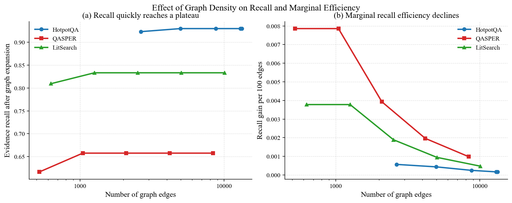

# 实验一：图密度与记忆压缩必要性实验报告

## 技术摘要

本实验用于回答一个关键方法问题：在语义联想检索中，是否只要持续增加图边数量，就能持续提升证据召回效果。

实验结果表明，图扩展确实能够在 embedding 检索基础上补回部分遗漏证据，但图边数量增加后，证据召回很快进入平台期，单位边带来的召回增益持续下降，并且会引入大量弱相关扩展节点。这说明 SAM 不能简单依赖更密集的底层知识图谱，而需要引入记忆重构与高层压缩机制，将底层图中的稳定关联、重复路径和高频证据组合压缩为更高层记忆单元，从而降低联想空间中的噪声。

本实验覆盖三个公开数据集：HotpotQA、QASPER 和 LitSearch。HotpotQA 主实验使用 300 个问题、2992 个候选段落和 600 个标准支持证据；QASPER 和 LitSearch 作为论文问答与科研检索场景补充验证。三组实验均观察到一致趋势：图扩展有效，但过密图结构的边际收益明显下降。

## 关键发现

**发现一：图扩展能够补回 embedding top-k 漏掉的部分证据。** 在 HotpotQA 300 条主实验中，embedding baseline 的证据召回率为 0.9083，加入图扩展后最高提升到 0.9300。在 QASPER 上，证据召回率从 0.5753 提升到 0.6575；在 LitSearch 上，从 0.7857 提升到 0.8333。这说明语义关联图对间接证据补充是有效的。

**发现二：图不是越密越好。** 当图边数量继续增加时，证据召回并不会持续提升。例如 HotpotQA 中边数从 4975 增加到 13272 后，证据召回率仍保持为 0.9300；QASPER 中边数从 1046 增加到 8368 后，证据召回率仍保持为 0.6575；LitSearch 中边数从 1260 增加到 10080 后，证据召回率仍保持为 0.8333。

**发现三：边际收益下降是压缩机制的直接动机。** 随着边数增加，每 100 条边带来的 recall 增益明显下降。HotpotQA 从 0.000436 下降到 0.000163；QASPER 从 0.007858 下降到 0.000982；LitSearch 从 0.003779 下降到 0.000472。这说明继续扩边的性价比很低，需要通过记忆重构减少无效联想空间。

**发现四：过密图会带来较高噪声扩展。** 三个数据集上的图扩展噪声率分别为 0.9145、0.9130 和 0.8889，说明扩展出的多数节点并不是标准支持证据。该结果说明后续系统不能只依赖底层图扩展，还需要将稳定路径和高频证据组合压缩为更可靠的高层记忆。

## 图示结果



图 1 展示了图边数量增加后的两类变化。左图表示证据召回率随边数增加很快进入平台期；右图表示每 100 条边带来的 recall 增益持续下降。需要注意的是，本实验并不声称原始 recall 随边数增加而下降，而是说明边际收益下降，即继续增加图边并不能带来成比例收益。

## 实验设置

本实验以 embedding top-k 检索作为基础检索结果，然后在候选文档集合内构建语义关联图，并从初始检索结果中选择 seed 节点沿图边进行一跳扩展。实验中固定 embedding 模型、基础检索 top-k、seed 数量和扩展跳数，只调整图构建阶段的密度参数。

实验流程如下：

1. 对候选文档和查询计算 embedding。
2. 使用 embedding top-k 得到基础检索结果。
3. 从基础检索结果中选取 seed 节点。
4. 在候选文档集合内部构建语义关联图。
5. 沿图边进行一跳扩展。
6. 统计图扩展是否补回 embedding top-k 漏掉的 gold evidence。
7. 改变图密度参数，比较不同图规模下的召回收益和噪声扩展。

本实验扫描两个主要参数：

- `top_k_edges`：每个节点最多保留多少条出边。该参数越大，图越密。
- `threshold`：建边得分阈值。该参数越高，只有更强的关联才会被保留。

本实验使用 `sam_context` 建图策略，即综合语义相似度和上下文路径邻近度进行非 LLM 建边。底层建边不调用大模型，避免把建图成本转移到 LLM 调用上。

## 数据集与任务

| 指标 | HotpotQA | QASPER | LitSearch |
|---|---:|---:|---:|
| 任务场景 | 多跳问答 | 论文问答 | 科研文献检索 |
| Query 数量 | 300 | 30 | 30 |
| 候选文档数量 | 2992 | 523 | 630 |
| Gold evidence 数量 | 600 | 73 | 42 |
| 平均每个 query 的 gold evidence 数 | 2.00 | 2.43 | 1.40 |
| 评测重点 | 多跳证据补全 | 长文论文证据补全 | 科研检索证据补全 |

HotpotQA 用于验证多跳问答中间接证据补全能力；QASPER 用于验证论文长文问答场景；LitSearch 用于验证科研文献检索场景。三个数据集共同覆盖从通用多跳问答到科研文本检索的不同任务形态。

## 评测指标

**Embedding Recall** 表示仅使用 embedding top-k 检索时，检索结果覆盖标准支持证据的比例。

**Graph-expanded Recall** 表示在 embedding top-k 基础上加入图扩展后，检索结果覆盖标准支持证据的比例。

**Recall 增益** 表示图扩展后相对于 embedding baseline 的证据召回提升，计算方式为：

```text
Recall 增益 = Graph-expanded Recall - Embedding Recall
```

**图扩展 Precision** 表示图扩展新增节点中有多少是真正的 gold evidence，计算方式为：

```text
图扩展 Precision = 图扩展补回的 gold evidence 数 / 图额外扩展节点数
```

**噪声扩展率** 表示图扩展出来但不是 gold evidence 的节点比例，计算方式为：

```text
噪声扩展率 = 1 - 图扩展 Precision
```

**每 100 条边 Recall 增益** 表示单位图边带来的召回收益，用于衡量图结构的性价比，计算方式为：

```text
每 100 条边 Recall 增益 = 100 * Recall 增益 / 图边数量
```

该指标越低，说明继续增加图边的边际收益越弱。

## 主结果

| 指标 | HotpotQA | QASPER | LitSearch |
|---|---:|---:|---:|
| 任务场景 | 多跳问答 | 论文问答 | 科研文献检索 |
| 数据规模 | 300 个问题 / 2992 个候选段落 / 600 个支持证据 | 30 个问题 / 523 个论文段落 / 73 个支持证据 | 30 个问题 / 630 个论文摘要 / 42 个支持证据 |
| Embedding Recall | 0.9083 | 0.5753 | 0.7857 |
| 最优图扩展 Recall | 0.9300 | 0.6575 | 0.8333 |
| Recall 增益 | +0.0217 | +0.0822 | +0.0476 |
| 达到最优收益所需边数 | 4975 | 1046 | 1260 |
| 更密图边数 | 13272 | 8368 | 10080 |
| 更密图是否继续提升 | 否 | 否 | 否 |
| 图扩展 Precision | 0.0855 | 0.0870 | 0.1111 |
| 图扩展噪声率 | 0.9145 | 0.9130 | 0.8889 |
| 每 100 条边 Recall 增益下降 | 0.000436 -> 0.000163 | 0.007858 -> 0.000982 | 0.003779 -> 0.000472 |

从表中可以看出，三个数据集均体现出相同趋势：图扩展能够提升证据召回，但边数增加后的收益很快进入平台期。更密的图没有继续提高 recall，反而降低了单位边收益。

## HotpotQA 主实验分析

HotpotQA 300 条实验是本实验的主结果。该实验包含 300 个问题、2992 个候选段落和 600 个标准支持证据。理论上，如果对所有候选文档两两建边，需要比较 8949072 个候选节点对；而 SAM 在 query 候选集合内进行局部建图，实际比较 26912 个候选节点对，约占全量候选空间的 0.30%。这说明 SAM 的按需局部建图首先在候选边空间上进行了强约束。

在效果上，embedding baseline 的证据召回率为 0.9083。加入图扩展后，最高证据召回率为 0.9300，Recall 增益为 0.0217。这说明图扩展能够补回 embedding top-k 漏掉的一部分间接证据。

但是，当边数继续增加时，收益并没有继续提升。在 `threshold=0.18` 时，边数从 4975 增加到 13272，证据召回率仍然保持在 0.9300；每 100 条边带来的 Recall 增益从 0.000436 下降到 0.000163。该结果说明，在 HotpotQA 多跳问答场景中，继续增加边数会显著降低建图性价比。

## QASPER 与 LitSearch 补充实验分析

QASPER 是论文问答任务，基础 embedding recall 为 0.5753，图扩展后最高提升到 0.6575，Recall 增益达到 0.0822。这个提升幅度高于 HotpotQA，说明论文长文问答中图结构对补充遗漏证据更有帮助。

但 QASPER 中同样存在边际收益下降问题。当边数从 1046 增加到 8368 后，证据召回率仍保持为 0.6575；每 100 条边的 Recall 增益从 0.007858 下降到 0.000982，下降到原来的约八分之一。

LitSearch 是科研文献检索任务，基础 embedding recall 为 0.7857，图扩展后最高提升到 0.8333，Recall 增益为 0.0476。当边数从 1260 增加到 10080 后，证据召回率不再提升；每 100 条边的 Recall 增益从 0.003779 下降到 0.000472，同样下降到约八分之一。

这两个补充实验说明，图密度增加导致边际收益下降并不是 HotpotQA 上的偶然现象，而是在论文问答和科研检索场景中也存在。

## 为什么该实验支持记忆压缩

本实验直接支持后续引入记忆重构与高层压缩机制，原因有三点。

第一，图结构有用，但底层图扩展存在噪声。三个数据集上，图扩展都提升了证据召回，说明语义图不是无效结构。但图扩展噪声率接近或超过 0.88，说明底层图扩展会带来大量弱相关节点。

第二，增加边数无法持续提升效果。边数增加后 recall 很快进入平台期，说明单纯加密底层图不是有效方向。系统需要从“扩展更多边”转向“筛选和重构更有效的关联”。

第三，压缩可以被解释为对联想空间的结构化约束。SAM 后续的高层压缩不应被理解为简单减少文本长度，而应理解为把底层图中的稳定证据组合、重复路径和高频语义关联重构为高层记忆单元。这样可以保留有效联想，减少弱相关路径干扰。

因此，本实验形成了完整的方法动机链条：

```text
图扩展能够补充遗漏证据
-> 无约束扩边会导致边际收益下降和噪声扩展
-> 系统需要受控联想
-> 受控联想需要记忆重构与高层压缩
```

## 与 SAM 系统设计的关系

本实验对应 SAM 当前阶段的两个核心方向。

一是动态知识图谱记忆。实验说明系统不能只停留在节点和边的存储层面，而需要进一步根据查询使用情况和图扩展反馈，对底层记忆结构进行重构。

二是语义关联路径检索。实验说明图路径能够补充 embedding 检索遗漏的证据，但路径有效性需要被进一步评分和筛选。后续应从简单图扩展推进到路径有效性评分、推理链重建和高层记忆生成。

因此，实验一不是终点，而是为后续方法改进提供依据。下一阶段应重点验证压缩后的高层记忆是否能够在相同检索预算下保持或提升证据召回，同时降低噪声扩展率和路径数量。

## 局限性与稳健性说明

本实验的主要局限在于，它证明的是“需要压缩”的必要性，而不是证明“压缩模块已经有效”。当前结果只能说明底层图变密后会出现边际收益下降和噪声扩展，因此后续必须补充压缩前后的对照实验。

第二，本实验中的 gold evidence 来自数据集标注，因此指标主要衡量证据召回，而不是最终答案生成质量。后续需要加入基于 LLM 的答案生成与答案正确性评测。

第三，当前图扩展只使用一跳扩展，尚未充分评估多跳路径下的噪声累积问题。理论上，扩展跳数增加后，噪声可能进一步放大，因此后续需要做路径长度和路径有效性评分实验。

第四，QASPER 和 LitSearch 当前是 30 条补充实验，规模小于 HotpotQA 主实验。它们可以支持趋势观察，但如果用于正式论文实验，需要进一步扩大数据规模。

## 后续实验计划

基于实验一结果，后续应补充三个实验。

第一，压缩前后对照实验。比较无压缩底层图、路径级压缩记忆和高层洞察记忆三种设置下的 evidence recall、噪声扩展率、平均路径数量和检索耗时。

第二，路径有效性评分实验。对图扩展得到的候选路径进行评分，比较不评分、只按边权评分、加入路径一致性评分、加入证据覆盖评分等设置，验证是否能够降低弱相关路径干扰。

第三，长文科研场景实验。扩大 QASPER 和 LitSearch 数据规模，进一步验证 SAM 在论文问答和科研文献检索任务中的效果，并观察高层压缩记忆是否能改善跨段落、跨论文的证据组织能力。

## 可复现实验命令

HotpotQA 300 条主实验命令如下：

```bash
SAM_EMBEDDING_CACHE_WRITE_BATCH_SIZE=200 /Users/bytedance/miniconda3/bin/conda run --no-capture-output -n sam python scripts/run_graph_density_experiment.py \
  --dataset-file data/processed/hotpotqa_midterm300_sam_sample.json \
  --limit-queries 300 \
  --embedding-provider azure_openai_sdk \
  --embedding-concurrency 20 \
  --embedding-input-mode single \
  --embedding-cache \
  --embedding-cache-path outputs/runs/hotpotqa300_real_embedding_cache_warmup/embedding_cache.sqlite \
  --strategy sam_context \
  --top-k-edges-sweep 1,2,4,8,16 \
  --threshold-sweep 0.18,0.25 \
  --top-k 5 \
  --seed-k 2 \
  --hops 1 \
  --pair-scope query_candidates \
  --context-path-policy intrinsic \
  --output-dir outputs/graph_density_hotpotqa300_real_embedding
```

QASPER 30 条补充实验命令如下：

```bash
SAM_EMBEDDING_CACHE_WRITE_BATCH_SIZE=200 /Users/bytedance/miniconda3/bin/conda run --no-capture-output -n sam python scripts/run_graph_density_experiment.py \
  --dataset-file data/processed/qasper_validation30_sam_sample.json \
  --limit-queries 30 \
  --embedding-provider azure_openai_sdk \
  --embedding-concurrency 20 \
  --embedding-input-mode single \
  --embedding-cache \
  --embedding-cache-path outputs/graph_strategy_experiment_qasper30/embedding_cache.sqlite \
  --strategy sam_context \
  --top-k-edges-sweep 1,2,4,8,16 \
  --threshold-sweep 0.10,0.18,0.25 \
  --top-k 5 \
  --seed-k 2 \
  --hops 1 \
  --pair-scope query_candidates \
  --context-path-policy metadata \
  --output-dir outputs/graph_density_qasper30_real_embedding
```

LitSearch 30 条补充实验命令如下：

```bash
SAM_EMBEDDING_CACHE_WRITE_BATCH_SIZE=200 /Users/bytedance/miniconda3/bin/conda run --no-capture-output -n sam python scripts/run_graph_density_experiment.py \
  --dataset-file data/processed/litsearch_query30_sam_sample.json \
  --limit-queries 30 \
  --embedding-provider azure_openai_sdk \
  --embedding-concurrency 20 \
  --embedding-input-mode single \
  --embedding-cache \
  --embedding-cache-path outputs/graph_strategy_experiment_litsearch30/embedding_cache.sqlite \
  --strategy sam_context \
  --top-k-edges-sweep 1,2,4,8,16 \
  --threshold-sweep 0.10,0.18,0.25 \
  --top-k 5 \
  --seed-k 2 \
  --hops 1 \
  --pair-scope query_candidates \
  --context-path-policy intrinsic \
  --output-dir outputs/graph_density_litsearch30_real_embedding
```

## 阶段结论

实验一表明，语义图扩展能够提升证据召回，但图边数量增加后，召回收益很快进入平台期，单位边收益显著下降，并引入大量噪声扩展节点。因此，SAM 后续方法设计不应继续追求更密的底层图，而应转向受控联想、记忆重构和高层压缩。

该实验为后续工作提供了清晰依据：压缩机制不是附加工程优化，而是解决语义联想检索中边际收益下降和噪声路径扩散问题的必要组成部分。
