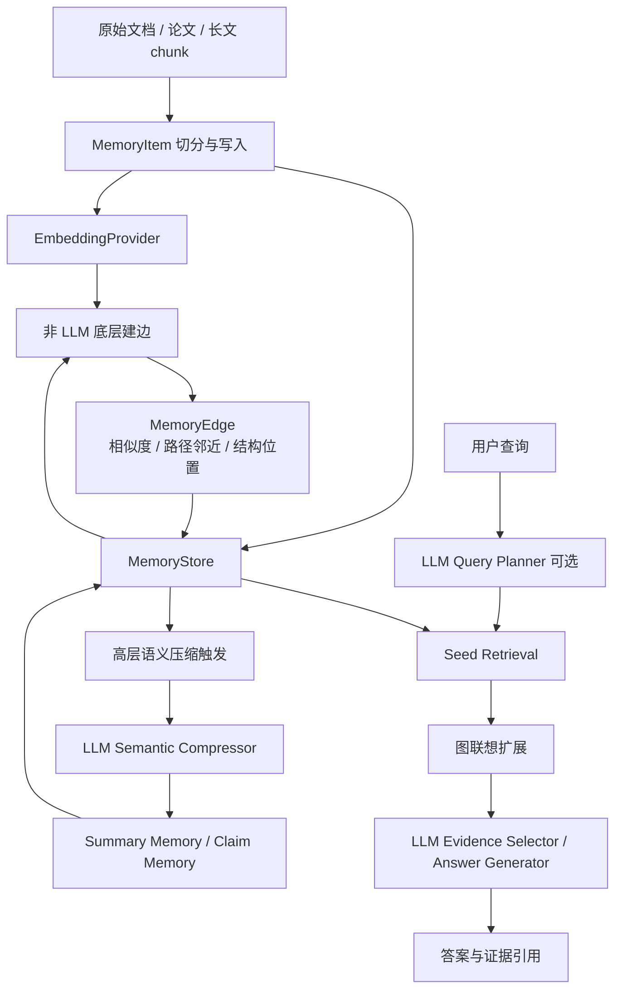

# SAM 中 LLM 使用边界设计

## 背景

SAM 后续需要和 CAM 等长文阅读记忆系统对齐实验口径。CAM 原系统并不是无 LLM 系统，它在高层摘要节点构建、查询阶段节点选择和最终回答生成中使用 LLM；同时，CAM 的在线插入时间图也指出 LLM operations 是主要开销之一。

SAM 不能简单地把 LLM 用到所有环节。尤其是低层图边如果对每一对候选节点都调用 LLM 判别，会导致建图成本不可控，也会削弱“按需、低成本、可扩展”的核心主张。因此本设计明确 SAM 的 LLM 使用边界。

## 核心决策

SAM 采用三层分工：

1. **底层建边不用 LLM**
   底层记忆边由 embedding 相似度、上下文路径邻近度、文档结构位置、关键词或实体重叠等可复现信号生成。默认主流程不对每条候选边调用 GPT-5.4 或其他大模型。

2. **高层语义压缩使用 LLM**
   当系统需要把多个底层 memory items 聚合为高层 summary memory、claim/evidence 摘要或研究主题摘要时，可以调用 LLM。LLM 的作用是做语义压缩和抽象，而不是参与全量底层建边。

3. **查询阶段使用 LLM**
   查询阶段可以调用 LLM 完成 query planning、证据筛选、冲突裁决、最终回答生成和 grounded answer judging。LLM 在这里服务于任务理解和答案生成，调用规模随 query 数增长，而不是随节点两两组合增长。

## 对 RelationJudge 的重新定位

现有 `RelationJudge` 能够调用 GPT-5.4 判断候选边是否有效。按照新的设计，它不再作为 SAM 主方法的默认建边模块，而保留为以下用途：

- 诊断实验：分析低层非 LLM 建边中哪些边是噪声边。
- 高风险过滤消融：只对弱关键词边或低置信语义相似边做小规模判别。
- 对照实验：评估“少量 LLM 辅助过滤”是否值得额外成本。

论文主方法应表述为“低层关系构建采用非 LLM 的可复现语义信号；LLM 主要用于高层语义压缩和查询阶段推理”。如果启用 RelationJudge，必须作为扩展消融或诊断，不应把它包装成默认 SAM。

## 系统数据流

## 模块边界

### GraphBuilder

`GraphBuilder` 只负责低层、可复现、低成本的候选边生成。默认输入为 memory items 和 embedding，输出为带分数拆解的 `MemoryEdge`。它不能在默认路径中依赖 LLM。

### SemanticCompressor

新增高层语义压缩接口，负责把一组相关 memory items 压缩成更高层 memory。实现可以包括：

- `ExtractiveCompressor`：本地抽取式摘要，用于测试和无 API 场景。
- `LLMSemanticCompressor`：调用 GPT-5.4 生成高层摘要。
- `CachedSemanticCompressor`：缓存 LLM 压缩结果，保证实验可复现并控制成本。

### QueryPlanner / AnswerGenerator

查询阶段允许使用 GPT-5.4。查询阶段调用规模与 query 数和候选证据数相关，可以通过 `top-k`、上下文预算、缓存和重试策略控制。

## 时间成本实验口径

后续复用 CAM Figure 3(a) 的实验口径时，应分别测：

- `SAM Online w/o LLM Refinement`：写入、embedding、非 LLM 局部建边。
- `SAM Online w/ LLM Refinement`：在上一项基础上增加高层语义压缩。

这样可以清楚回答两个问题：

- SAM 的底层记忆更新是否低成本。
- 引入 LLM 高层语义压缩后，成本是否仍低于离线重建方法。

GraphRAG 和 RAPTOR 在该实验中可以使用 CAM 论文报告的离线重建时间作为引用基准；SAM 必须在相同 batch size 和 512-token chunk 设置下测试自己的在线插入时间。

## 测试要求

- 默认 `GraphBuilder` 单元测试不得依赖 LLM。
- 高层压缩模块必须有本地 fake/compressor 测试，不能因为 API 不可用导致测试失败。
- LLM 压缩结果必须写入缓存或运行产物，避免同一实验不可复现。
- 时间成本脚本必须在结果中标明是否包含 embedding 时间、是否包含 LLM 压缩时间、chunk token size 和 batch size。

## 论文表述

建议论文中使用如下表述：

> SAM 将大模型从低层全量关系判别中移出，只在高层语义压缩和查询阶段推理中使用。底层图结构由可复现的语义相似、上下文路径和结构邻近信号构建，从而避免节点两两组合带来的大模型调用成本；高层记忆摘要和答案生成则利用大模型的语义抽象能力，兼顾成本、可解释性和长文理解能力。
