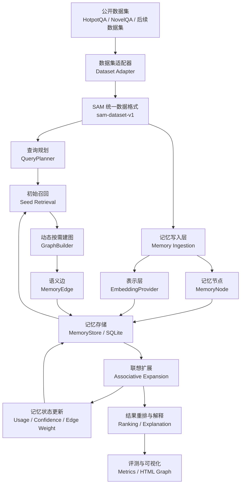
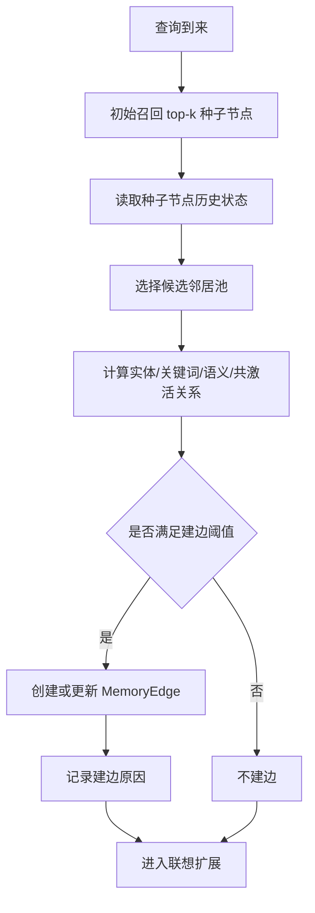
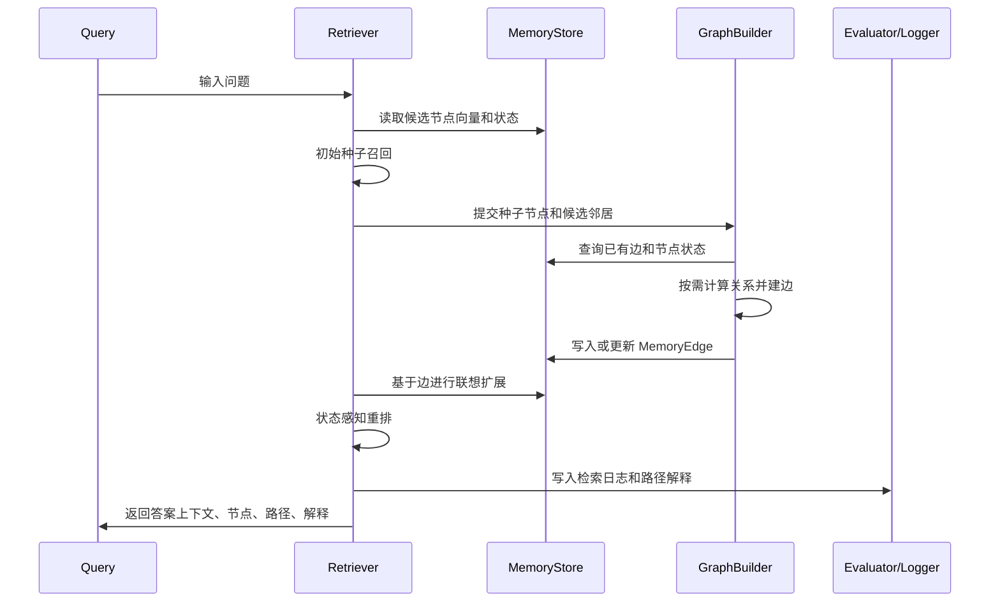

# SAM 系统设计文档

本文档用于说明硕士论文《基于语义联想机制的动态知识图谱记忆系统方法与实现》的后续项目设计。当前阶段不再把工作卡在 embedding 模型选择上，而是先把系统结构、模块边界、动态记忆机制和实验路线设计清楚。Embedding 只作为可替换基础能力接入，不影响主系统继续推进。

## 1. 项目定位

SAM 的目标不是再做一个普通 RAG demo，而是实现一个具有动态记忆演化能力的知识图谱记忆系统。传统 RAG 通常将文档切块后写入向量库，查询时直接按 query-document 语义相似度取 top-k。这个流程简单，但在多跳问答、长文本阅读和跨文档推理中容易出现两个问题：

- 证据链断裂：某个关键证据和用户问题并不直接相似，只和另一个已命中证据相关。
- 记忆状态静态：系统不会根据历史访问、使用频率和上下文激活情况调整记忆结构。

SAM 希望解决的是第二层问题：系统不只检索文本，还要形成可解释、可更新、可追踪的记忆网络。

## 2. 核心思想

SAM 将知识表示为动态记忆图：

- 记忆节点：表示一段文档、一个段落、一个小说 chunk 或一个中间摘要。
- 语义边：表示两个记忆节点之间的实体共现、关键词重叠、语义相似、历史共激活或任务反馈关系。
- 检索激活：一次查询会先激活少量种子节点，再沿图进行联想扩展。
- 按需建图：不是一开始全量两两建边，而是在节点被访问、被命中或被共同激活时逐步补充边。
- 状态更新：每次检索都会更新节点使用次数、访问时间、置信度和边权。

这使 SAM 和 GraphRAG、RAPTOR、HippoRAG 的区别更清楚：

| 方法 | 核心特征 | 结构是否动态 | SAM 对比点 |
| --- | --- | --- | --- |
| 向量检索 | query-document 相似度 top-k | 否 | SAM 增加图联想和状态更新 |
| RAPTOR | 递归聚类与摘要树 | 主要静态 | SAM 不只依赖摘要层级，而是围绕访问动态建边 |
| GraphRAG | 实体图和社区摘要 | 主要静态 | SAM 强调检索过程中的记忆演化 |
| HippoRAG | KG 激活和 PPR 传播 | 图结构多为预构建 | SAM 的边和权重会随使用变化 |
| SAM | 按需图构建、联想检索、记忆状态 | 是 | 论文主方法 |

## 3. 总体架构



## 4. 模块设计

### 4.1 Dataset Adapter

不同公开数据集的原始格式差异很大，因此系统不应该围绕 HotpotQA 或 NovelQA 的字段写死。所有外部数据集必须先转换成 `sam-dataset-v1`。

统一格式中的核心对象：

- `documents`：候选记忆文档，每个 document 可以来自 Wikipedia 段落、小说 chunk、论文段落等。
- `queries`：评测问题，包含问题文本、标准答案、支持证据和数据集特有 metadata。
- `dataset_info`：记录数据集名称、来源、版本、license 或下载说明。
- `processing`：记录转换脚本、切分策略、样本数量等，保证实验可复现。

后续新增数据集时，只需要新增一个专门处理脚本，例如：

```text
scripts/prepare_xxx.py -> data/processed/xxx_sam_sample.json
```

核心检索系统只读取统一格式，不直接读取原始数据集。

当前新增了可选的 `metadata.retrieval_query` 字段，用于保存数据集适配阶段生成的扩展检索文本。例如 NovelQA 会把原问题、问题关键词、问题类型和复杂度写入该字段，但不会默认拼接全部选项答案。Evaluator 默认仍使用原始 question，只有在运行脚本中显式增加 `--use-retrieval-query` 时才启用扩展查询。这样可以把 query expansion 作为消融变量，而不会让带噪声的扩展查询污染主实验。

### 4.2 QueryPlanner

QueryPlanner 是当前新增的查询理解模块。它位于数据集适配和 Retriever 之间，负责把原始问题转换为更适合检索的 `retrieval_query`，同时保留关键词、实体和规划原因。

当前支持两种模式：

- `heuristic`：基于问题关键词、显式实体、Aspect、Complexity 等元信息生成检索文本，不拼接 NovelQA 的全部候选选项，避免干扰选项污染召回。
- `gpt54`：通过聊天模型生成结构化 query plan，预留给后续正式实验，用于抽取角色实体、事件触发词、待验证关系和检索意图。

QueryPlanner 和 Dataset Adapter 的 `metadata.retrieval_query` 分工不同：前者是运行时策略，可以作为实验变量切换；后者是数据转换阶段保存的静态扩展字段。Evaluator 在传入 `query_planner` 时优先使用运行时规划结果，并把每条样本的规划内容写入 `cases.json`，便于 bad case 分析。

这一模块对应开题计划中的“语义理解和语义联想触发”部分。它解决的问题不是简单增加关键词，而是让系统在进入图检索前先明确：本题需要寻找人物关系、事件次数、因果关系，还是跨文档桥接证据。后续接入 GPT-5.4 后，可以进一步把查询规划结果用于控制种子节点数量、候选边类型和路径重排权重。

### 4.3 MemoryNode

记忆节点是系统的最小可检索单元。当前设计字段包括：

| 字段 | 含义 |
| --- | --- |
| `id` | 系统内部节点 ID |
| `source_id` | 原始数据集中的文档或 chunk ID |
| `title` | 可选标题，不要求所有数据集都有 |
| `text` | 节点正文 |
| `summary` | 可选摘要，后续可由 LLM 或抽取式方法生成 |
| `keywords` | 关键词或实体短语 |
| `source` | 数据来源，例如 HotpotQA、NovelQA |
| `timestamp` | 写入时间 |
| `usage_count` | 节点被检索或扩展命中的次数 |
| `confidence` | 节点可信度或任务相关置信度 |
| `embedding` | 可替换表示向量 |

重要设计点：`title` 只是可选展示字段，不作为系统通用假设。对于 NovelQA，标题可以是小说名和 chunk 编号；对于论文数据，标题可以是章节名；没有标题的数据集也可以正常运行。

当前新增了 `query_summary` 类型的摘要记忆节点。它由同一查询候选上下文中的多个文档节点聚合而成，保存候选标题、关键词和文档摘要。摘要节点不作为 gold evidence 计分，只作为联想检索中的中间层记忆，使 SAM 能够形成：

```text
种子文档 -> 摘要记忆节点 -> 相关候选文档
```

这一步是吸收 RAPTOR 实验优势后的系统改造：不把摘要层级做成独立静态索引，而是把摘要节点纳入动态记忆图。

### 4.4 MemoryEdge

语义边用于解释两个节点为何产生联想关系。边不是抽象黑盒相似度，而是带有类型和创建原因。

| 字段 | 含义 |
| --- | --- |
| `source_node_id` | 起点节点 |
| `target_node_id` | 终点节点 |
| `relation_type` | 关系类型 |
| `weight` | 边权 |
| `reason` | 建边原因 |
| `created_by` | 建边模块 |
| `created_at` | 创建时间 |
| `last_activated_at` | 最近激活时间 |

当前可支持的关系类型：

- `semantic_similarity`：文本语义相似。
- `entity_overlap`：实体或专名重叠。
- `keyword_overlap`：关键词重叠。
- `co_activation`：两个节点在同一次检索中共同出现。
- `feedback_strengthened`：用户反馈或任务结果强化。
- `summary_parent`：摘要节点和原始 chunk 的层级关系。
- `summary_child`：原始文档节点回到摘要记忆节点的反向层级关系。

边质量控制是当前阶段的重点之一。系统已经加入低信息关键词过滤：当候选边只依赖 `system`、`report`、`data`、`question`、`evidence` 等泛化词重叠时，不再创建语义边，而是在候选边打分中记录 `edge_quality` 和跳过原因。这一约束用于防止动态图谱在按需扩展时积累噪声边。

在此基础上，系统新增了关系级建边判别接口 `RelationJudge`。`GraphBuilder` 可以在规则 scorer 产生候选边之后，把两个记忆节点、关键词、实体、相似度和初始关系类型提交给判别器，由 GPT-5.4 判断是否真的存在可解释关系。如果判别器认为只是偶然相似或主题不同，则候选边会被跳过；如果判别器认为关系成立，则把模型给出的关系类型、置信度和原因写入 `score_breakdown`。这样可以把动态图谱构建从“词面重叠和向量相似”推进到“关系有效性判断”。当前实现还提供 `CachedRelationJudge`，推荐通过 `--relation-judge cached_gpt54` 启用，它会把判别结果写入 `outputs/cache/relation_judge_cache.json`，降低重复实验的模型调用成本。

### 4.5 EmbeddingProvider

Embedding 暂时不是主线阻塞点。系统只要求它满足统一接口：

```text
embed_text(text) -> vector
embed_batch(texts) -> vectors
```

后续可以接入多种实现：

- `HashEmbeddingProvider`：无依赖 smoke test，保证流程能跑。
- `LocalSentenceTransformerProvider`：本地模型，例如 Qwen3-Embedding、BGE、E5。
- `OpenAICompatibleEmbeddingProvider`：公司或云端 OpenAI-compatible embedding API。
- `HFInferenceEmbeddingProvider`：Hugging Face 在线 feature extraction。

论文实现上，EmbeddingProvider 是基础表示模块，不是 SAM 的核心创新点。SAM 的创新点放在动态建图、记忆状态更新和联想检索机制上。

### 4.6 GraphBuilder

GraphBuilder 负责按需建图。它不在数据写入时做全量两两比较，而是在以下场景触发建边：

- 新节点被多次访问。
- 查询命中某个种子节点。
- 两个节点在一次检索中共同出现在候选集中。
- 节点被评测证明包含支持证据。
- 用户或系统反馈某条路径有用。

按需建图流程：



这样可以直接回应开题专家担心的建图时间成本：SAM 不追求全量图，而是让图结构随访问逐步成长。

当前实现进一步把按需建图从“只围绕初始种子节点”扩展为“沿联想路径逐步触发”。检索开始时系统仍只对向量召回的少量种子节点补边；当 BFS 扩展到新的桥接节点后，如果该节点尚未触发过建边，系统会围绕该桥接节点继续按需补边。这样可以覆盖典型多跳问答中的模式：

```text
问题相关种子文档 -> 桥接实体文档 -> 答案证据文档
```

该改动仍然不是全量建图，因为只有被当前查询激活的节点才会触发补边。为避免强图路径被低向量相似度过度压制，`PathReranker` 对高置信图路径加入语义保底：当候选节点拥有足够强的图路径分和路径支持分时，负向量相似度不会继续拉低总分。这一机制用于保护跨文档桥接证据，尤其是答案文档和原始问题表面词不直接相似的情况。

### 4.7 Retriever

SAM 检索不是单步 top-k，而是多阶段过程：

1. 查询理解：抽取查询关键词、实体、任务类型。
2. 种子召回：用 embedding 或其他轻量方式找到初始候选。
3. 按需建图：围绕种子节点补充或更新边。
4. 联想扩展：沿高权重边扩展一跳或两跳。
5. 状态感知重排：综合相似度、路径权重、使用频率、置信度和时间因素。
6. 解释输出：返回命中节点、扩展路径、边类型和排序依据。
7. 记忆更新：写入访问日志，更新节点和边的状态。

最终输出不只是文档列表，而是：

```text
query -> seed nodes -> activated edges -> expanded nodes -> ranked results -> explanation paths
```

### 4.8 Evaluator

评测模块分两层：

第一层是 SAM 自身可控评测：

- evidence recall
- answer hit
- supporting document hit count
- path length
- activated edge count
- new useful evidence from expansion

对于 NovelQA 这类长答案数据，`answer hit` 不再只依赖完整字符串精确出现。Evaluator 会先检查标准答案或选项文本是否出现在检索上下文中；如果答案是较长的实体/描述列表，还会计算答案关键内容词覆盖率，覆盖率达到阈值时记为 `answer_terms_covered`。这仍然只是“检索上下文是否具备回答基础”的轻量指标，不替代 GPT-5.4 生成评测或 NovelQA 官方评价。

第二层是官方 baseline 评测：

- RAPTOR 官方实现。
- Microsoft GraphRAG 官方实现。
- HippoRAG 官方实现。

短期先保证 SAM 自身实验闭环完整；官方 baseline 因依赖和 API 成本较高，可以作为后续增强实验。

## 5. SAM 检索流程详解



## 6. 动态记忆更新机制

SAM 的“动态”不应该只停留在口头上，需要在代码和运行产物中可检查。后续实现时，每次检索至少更新以下内容：

- `usage_count += 1`：被命中的节点使用次数增加。
- `last_accessed_at`：记录最近访问时间。
- `edge.activation_count += 1`：被走过的边激活次数增加。
- `edge.weight`：共同命中或证据有效时增强。
- `retrieval_log`：记录本次查询的种子、扩展路径、最终结果。

边权更新可以先采用简单公式：

```text
new_weight = old_weight * decay + relation_score * alpha + feedback_score * beta
```

其中：

- `decay` 控制历史边权衰减。
- `relation_score` 来自实体、关键词或语义关系。
- `feedback_score` 来自答案命中或证据命中。

先实现这个基础版本，后续再加入更复杂的学习式权重更新。

当前系统已经进一步加入记忆巩固机制。反馈模块发现某次 SAM 检索命中支持证据后，`MemoryConsolidator` 会生成一个 `consolidated_memory` 长期记忆节点，把“问题、标准答案、检索方法、答案状态、支持证据摘要”沉淀为新的记忆单元。该节点通过 `consolidates_support` 边连接到原始支持证据，原始证据节点也会记录 `consolidated_by` 和 `consolidation_count`，表示它已经被某次成功推理吸收为长期经验。

这一步对应开题报告中的“记忆重构”：系统不只记录访问次数，也会把被验证有效的证据链重写为更高层次的经验节点。后续连续任务或类比推理可以直接检索这些巩固节点，而不是每次都从原始段落重新组合证据。

巩固节点在检索中的角色是“中间记忆”，不是最终证据。SAM 方法会把已有 `consolidated_memory` 加入候选池，使其可被向量激活或图路径经过；最终返回 top-k 时会过滤这些巩固节点，避免摘要化经验替代原始证据。这样既能利用历史经验，也能保持评测中的证据可追溯性。

为了验证历史经验复用，系统新增连续记忆复用实验。实验分为两阶段：warmup 阶段先让 SAM 在正常候选集上完成检索并生成巩固记忆；probe 阶段将同一批问题中的 gold 支持文档从候选集中移除，只保留普通干扰文档。Embedding Top-k 在这种设置下无法命中被移除的支持证据；SAM 则可以通过巩固记忆记录的 `support_node_ids` 将原始支持证据带回候选池，再进行联想检索。这个实验专门检验“历史经验能否在后续任务中补全缺失证据”。

类比推理模块现在也会利用巩固记忆。`AnalogyEngine` 在返回历史案例时，会识别案例中是否存在 `consolidated_memory`，并暴露该案例的答案、支持证据节点、支持证据标题和匹配关系路径。类比复用实验会在 masked probe 查询上检索历史案例，统计是否命中对应巩固案例以及是否覆盖真实支持证据。这样类比推理不再只是相似文本检索，而是可以引用“已被验证过的证据链经验”。

最新结构类比实验进一步加入 `relation_pattern_for_case`。系统会从来源案例的记忆图中抽取代表性关系路径，再用该路径模式约束类比检索。HotpotQA 30 条结构类比复用实验中，来源案例命中率为 1.000，结构路径匹配率为 1.000，巩固案例命中率和支持证据重叠命中率均为 0.900。bad case 主要是 `source_case_without_consolidation`，说明当前类比触发已经能找回结构相似案例，后续瓶颈转向记忆巩固是否充分覆盖支持证据链。

## 7. 可解释性设计

用户必须能看懂 SAM 为什么选这些节点。每条结果至少提供：

- 节点文本和来源。
- 节点是否是初始种子。
- 节点是否由图扩展得到。
- 从哪个种子节点扩展而来。
- 经过哪些边。
- 每条边的关系类型和建边原因。
- 最终排序分数构成。

HTML 可视化应重点展示：

- 同一问题下不同方法的图结构对比。
- 节点点击查看完整文本和 MemoryNode 状态。
- 边点击查看 relation type、weight、reason。
- 右侧固定区域展示不同方法共同命中的节点。
- 显示问题、标准答案、各方法答案和证据命中状态。

## 8. 后续开发优先级

当前优先级不再是 embedding，而是让 SAM 主方法更像一个真正的动态记忆系统。

### P0：把动态记忆状态做实

目标：每跑一次 query，数据库中的节点和边状态真的发生变化。

任务：

- 为 MemoryNode 增加 `last_accessed_at`。
- 为 MemoryEdge 增加 `activation_count` 和 `last_activated_at`。
- 检索后写入 retrieval log。
- HTML 中展示节点使用次数、边激活次数和最近访问时间。

验收：

- 连续查询同一个问题，相关节点 `usage_count` 增加。
- 图上边权或激活次数变化可见。
- `cases.json` 能解释状态变化。

### P1：实现更清晰的按需建图策略

目标：把“为什么建这条边”变成可审计产物。

任务：

- 将建边拆成多个 scorer：实体、关键词、语义、共激活。
- 每条边保存 score breakdown。
- 设置不同关系类型的阈值。
- 限制每个种子节点最大新增边数，控制成本。

验收：

- HTML 点击边能看到具体建边原因。
- run 目录中输出 `edge_creation_log.json`。
- 可以统计每次 query 新建了多少条边。

### P2：把 SAM 检索和传统检索差异拉大

目标：SAM 不再只是“向量召回加一跳扩展”。

已完成初版：

- 引入多路径激活：同一节点可累积来自多条候选路径的支持信号。
- 引入记忆状态：节点使用次数、近期访问状态和边历史激活会进入排序分数。
- 输出分数分解：每个 SAM 命中结果记录相似度、图分、路径支持、边记忆、使用频率、近期访问和置信度分量。

后续任务：

- 继续优化二跳扩展，但默认稳定主流程采用一跳局部联想；二跳需要 RelationJudge 和路径重排进一步控制噪声。
- 对使用频率和时间衰减参数进行更系统的消融实验。
- 将多路径激活与摘要层级节点结合。

验收：

- 输出每个结果的分数分解。
- 能看到某些节点不是 top-k 种子，但通过路径被补回。
- 评测中统计 `新增有效证据数`。

### P3：完善实验与论文材料

目标：中期和毕业论文都能直接引用结果。

已完成初版：

- 新增 `sam_full`、`sam_no_multipath`、`sam_no_memory_state`、`sam_no_graph`、`sam_static_graph` 五种消融检索模式。
- 固定 HotpotQA bridge-style 300 条主实验，包含 2992 个候选文档节点和 600 个 gold supporting documents。
- 完成真实 embedding endpoint 300 条主实验，运行目录为 `outputs/runs/hotpotqa300_real_embedding_main_v4_hops1/`。
- 输出 `ablation_metrics.json`、`ablation_metrics.md`，记录证据召回率、答案命中率、平均路径长度、平均候选路径数、平均路径支持分和平均边记忆分。
- 将按需建图限制在当前查询候选记忆范围内，并对节点、边和检索日志写入做批量化与轻量化处理，使 300 条实验可以稳定跑通。
- 新增 query summary memory node，并提供 `sam_with_summary` 实验开关。当前稳定主方法暂不默认启用摘要节点，因为 30 条隔离 smoke run 显示摘要层级会带来过宽跳转噪声；但该模块已经可用于后续消融和重排优化。
- 修正多方法评测协议：每个方法从同一份初始记忆库快照开始运行，避免前一个方法的动态状态更新污染后一个方法的结果。当前实现会先保存 baseline sqlite 快照，再为每种方法复制独立临时库。

后续任务：

- 固定 HotpotQA 300 条消融实验和 NovelQA demonstration 样本。
- 每次实验输出完整 config、metrics、cases、graphs。
- 生成 `docs/experiment_protocol.md`。
- 生成 `docs/thesis_method_notes.md`，整理方法章节素材。

验收：

- 一条命令重现实验。
- README 只放入口说明，详细实验协议放 docs。
- 中期总结可以真实写“已完成动态记忆原型与可解释实验产物”。

### P4：消融实验设计

当前消融实验用于说明 SAM 内部模块分别贡献了什么：

| 方法 | 开关含义 | 观察重点 |
| --- | --- | --- |
| `sam_full` | 完整 SAM，启用图扩展、多路径、记忆状态和动态更新 | 主方法效果 |
| `sam_no_multipath` | 关闭多路径累积，只保留单条最佳路径 | 多路径是否提升证据召回 |
| `sam_no_memory_state` | 不使用 usage、recency、edge activation 分数 | 动态记忆状态是否影响排序 |
| `sam_no_graph` | 不进行图扩展，只保留初始召回和状态分 | 图联想是否补回间接证据 |
| `sam_static_graph` | 使用已有图，但检索后不更新动态状态 | 动态更新和历史边激活的影响 |
| `sam_no_summary` | 保留 SAM 其他机制，但移除 query summary memory node | 摘要记忆节点是否带来增益 |
| `sam_with_summary` | 在 SAM 中启用 query summary memory node | 摘要层级是否能帮助或干扰图扩展 |
| `sam_no_feedback` | 检索逻辑同 SAM-full，但不执行反馈强化/抑制 | FeedbackUpdater 是否带来跨查询记忆收益 |
| `sam_vector_anchor` | 保留更多初始向量候选作为锚点，再进行图扩展重排 | 防止噪声图路径挤出有效向量证据 |
| `sam_adaptive_anchor` | 当扩展路径平均支持分不足时，自动提高向量锚点数量 | 区分高质量联想路径和低置信图扩展 |

真实 embedding 300 条主实验中，SAM-full 的证据召回率为 0.890，答案命中率为 0.907；Embedding Top-k 为 0.877 / 0.907；`sam_no_graph` 为 0.877 / 0.907；RAPTOR 为 0.890 / 0.910；HippoRAG 为 0.882 / 0.903；GraphRAG 为 0.795 / 0.823。该结果说明一跳图联想可以在强 embedding baseline 上继续补回部分间接证据。二跳版本在同一真实 embedding 设置下召回率降到 0.860，说明当前二跳路径噪声仍需 RelationJudge 和更强路径重排控制。`sam_with_summary` 在旧隔离评测中低于 SAM-full，说明摘要记忆节点需要更细粒度构造，不能简单作为中心节点连接所有候选文档。

反馈机制专门消融实验位于 `outputs/runs/feedback_ablation_hotpotqa_300_isolated/`。该 run 中 `sam_full` 和 `sam_no_feedback` 的证据召回率均为 0.603，答案命中率均为 0.597，说明在 HotpotQA 这种“每个问题只问一次、候选集按问题隔离”的单轮评测中，反馈强化还没有机会形成跨查询复用收益；但 `sam_full` 额外产生了 362 条 `support_hit`、179 条 `answer_hit` 和 705 条 `path_rejected` 反馈事件，系统已经具备将检索结果写回记忆图的机制。下一步应设计共享实体或重复主题的多轮实验，专门验证反馈边权是否能在后续查询中改变排序。

### P5：事件化动态记忆与路径重排

接下来需要把“动态记忆”从状态字段推进到事件机制。当前系统已经有 usage、recency 和 edge activation，但它们还只是结果状态。下一步应增加 MemoryEvent：

| 事件类型 | 含义 | 用途 |
| --- | --- | --- |
| `node_retrieved` | 节点进入最终 top-k | 统计被反复使用的核心记忆 |
| `edge_traversed` | 检索路径经过某条边 | 识别有效推理路径 |
| `support_hit` | 命中 gold supporting document | 反向强化相关节点和边 |
| `answer_hit` | 当前上下文可支持答案 | 作为任务级反馈 |
| `path_rejected` | 路径扩展后未贡献证据 | 降低噪声边权 |

同时引入 PathReranker，把当前经验加权拆成独立模块：

```text
final_score = semantic_score + graph_score + path_quality + memory_state + feedback_score
```

这样后续论文中可以更清楚地说明 SAM 如何从“检索结果”学习到“记忆结构调整”。

当前已完成 P5 初版：

- 新增 `MemoryEvent` 数据模型和 `memory_events` 表。
- 检索阶段写入 `node_retrieved`、`edge_traversed` 事件。
- 评测反馈阶段写入 `support_hit`、`answer_hit`、`path_rejected` 事件。
- 新增 `PathReranker`，将相似度、图分、路径支持、边历史、usage、recency 和 confidence 拆成独立评分模块。
- `PathReranker` 已支持 `balanced`、`semantic_heavy`、`graph_heavy`、`memory_heavy` 四种 profile，并可通过 `--reranker-profile` 控制。根据 HotpotQA 300 条 profile 对比实验，当前默认 profile 调整为 `semantic_heavy`。每条 SAM 检索结果会写入 profile 和 `score_breakdown`，用于 bad case 后判断应该增强语义相似、图路径、多路径支持还是历史记忆状态。
- `PathReranker` 新增过密路径惩罚 `path_noise_penalty`。当某个候选节点由过多路径同时到达时，系统不再把路径数量直接视为强支持，而是将其视为潜在 hub 噪声。该机制主要针对 NovelQA 长文本场景中大量相邻 chunk、代词和弱关键词造成的虚假多路径。
- `PathReranker` 新增弱关系二跳惩罚 `weak_relation_penalty`。当二跳路径末端依赖 `embedding_similarity`、`context_cooccurrence` 或弱 `keyword_overlap` 时，系统会小幅降低最终排序分；`shared_entity` 等强实体关系不受影响。该机制用于保留弱边探索能力，同时降低弱关系路径进入最终 top-k 的概率。
- 新增 `run_reranker_profile_experiment.py`，可以在隔离数据库中批量比较多个 profile，并输出每种 profile 的指标与 bad case 类型统计。
- 新增 `FeedbackUpdater`，当路径命中支持证据时强化路径边权，扩展路径未命中支持证据时轻微抑制边权。
- 每次 run 输出 `memory_events.json` 和 `memory_events.md`，可以直接检查记忆演化过程。

300 条 HotpotQA 真实 embedding 主实验中，事件统计如下：

| 事件类型 | 数量 |
| --- | ---: |
| `node_retrieved` | 1198 |
| `edge_traversed` | 898 |
| `support_hit` | 534 |
| `answer_hit` | 240 |
| `path_rejected` | 624 |
| `memory_consolidated` | 300 |

这一步让 SAM 的动态性从“字段值变化”推进到“可追踪事件流”：系统不只是返回结果，还能记录哪些节点被访问、哪些边被走过、哪些路径被证明有效或无效，并据此调整边权。

### P6：类比推理与多智能体共享记忆

开题报告中还规划了类比推理触发器和多智能体语义记忆共享机制。当前已补充两项最小可运行实现：

- `AnalogyEngine`：把同一任务或同一查询上下文下的记忆组织为历史案例，综合查询语义相似度、关键词重叠、案例内部关系类型和关系路径模式，返回可类比的历史案例，并生成可注入 LLM 的提示文本。`relation_pattern` 参数用于表达当前问题激活出的关系链，例如 `shared_entity -> keyword_overlap`；系统会在历史案例内部枚举短路径并计算路径模式匹配分。新增 `relation_pattern_for_case()` 后，实验可以从历史案例图中自动抽取代表性关系路径，避免只靠人工指定路径模式。
- `SharedMemoryCoordinator`：提供多智能体共享记忆接口，将记忆分为 `global_insight`、`session`、`interaction` 三层，分别对应开题报告中的全局洞察层、会话层和交互细节层。不同智能体可以向共享记忆写入内容，也可以按层级和会话查询相关记忆。当前还支持 `write_handoff()`，用于把规划智能体、检索智能体、写作智能体等角色的中间结论定向传递给下一个智能体。查询阶段支持按目标 agent、来源 agent、task、冲突状态和最新版本过滤，默认不会把已裁决废弃的 rejected 版本带入后续 writer 或 verifier 上下文，避免共享记忆池污染。
- `MultiAgentResearchWorkflow`：将 planner、retriever、writer、verifier 四个角色串成一个可运行协作流程。planner 写入全局规划记忆，retriever 将检索证据 handoff 给 writer，writer 读取共享记忆并生成答案，verifier 再读取 writer 的 handoff 进行验证。当前 retriever handoff 已包含候选证据片段和检索依据，writer 读取到的共享记忆会作为 `supplemental_contexts` 进入 `ContextAnswerGenerator`，并参与 grounding gate，而不只是普通提示文本。脚本 `scripts/run_agent_workflow.py` 会输出 `agent_workflow.json` 和 `agent_workflow.md`，用于检查每个角色是否实际读写了共享记忆。
- `run_agent_memory_reuse_experiment.py`：读取连续记忆复用实验中的 probe cases，进一步统计共享记忆是否真正承接 SAM 相对 baseline 的证据增益。该实验会检查 retriever 的证据 handoff 是否被 writer 读取、writer 的结果 handoff 是否被 verifier 读取，以及有效证据增益是否通过多智能体链路传递。
- `run_agent_generation_experiment.py`：对比“无共享记忆”“共享记忆”“共享记忆+类比提示”三种答案生成设置。该脚本用于把共享记忆机制推进到最终答案层面，后续可直接切换 GPT-5.4 生成器运行正式实验。
- `AzureOpenAIEmbeddingProvider` / `AzureOpenAISDKEmbeddingProvider`：支持通过环境变量接入 Azure OpenAI 兼容 embedding 服务。前者使用项目内置 HTTP client，后者使用 OpenAI SDK 的 `AsyncAzureOpenAI` 并通过异步信号量控制并发，使后续实验可以从本地哈希 embedding 切换到正式语义表示模型。

当前 P6 已从“接口占位”推进到“可测试原型”：单元测试覆盖了关系路径匹配优先级、来源案例结构路径抽取、智能体定向 handoff 过滤和四角色协作流程。后续需要增加：

- 类比触发率、类比案例命中率和类比后答案提升等指标。
- 基于 GPT-5.4 的最终答案生成和类比提示效果评测。

多智能体协作 smoke run 已完成，路径为 `outputs/runs/analogy_generation_smoke/agent_workflow/`。在启发式本地生成器下，3 条样本均完成 planner -> retriever -> writer -> verifier 四步，且每条样本写入 4 个共享记忆节点；由于本地生成器不代表真实 GPT-5.4 能力，verifier 通过率为 0.000。该结果用于验证协作记忆链路可运行，正式结论需要接入 GPT-5.4 后重跑。

多智能体共享记忆复用实验已完成，路径为 `outputs/runs/agent_memory_reuse_hotpotqa30/`。在 30 条 HotpotQA 连续复用 probe 中，Embedding Top-k 支持证据命中数为 0，SAM 支持证据命中数为 31；其中 22 条样本形成了 retriever -> writer -> verifier 的有效共享记忆链路，链路成功率为 0.733。该结果说明多智能体模块已经从“流程可运行”推进到“共享记忆复用可量化”。当前实验重点验证跨角色证据传递，答案生成质量后续需要使用 GPT-5.4 做正式对照。

多智能体生成对照 smoke run 已完成，路径为 `outputs/runs/agent_generation_hotpotqa30_smoke/`。该 run 在本地启发式生成器下完成 30 条样本，`baseline`、`shared_memory`、`shared_memory_with_analogy` 三种设置均生成了答案和报告；其中 `shared_memory_with_analogy` 的平均 prompt token 估计从 baseline 的 698.9 增加到 923.2，说明共享记忆和类比提示已经进入生成上下文。本地启发式生成器的答案命中率为 0.000，不作为模型效果结论。正式实验应使用 GPT-5.4 重跑同一脚本，重点观察共享记忆和类比提示是否提升答案命中率、证据引用完整性和失败样本恢复率。

本轮进一步完成共享记忆 grounded context 改造，路径为 `outputs/runs/agent_generation_shared_context_hotpotqa30/`。30 条诊断结果显示，baseline 的上下文含答案样本数为 7，`shared_memory` 和 `shared_memory_with_analogy` 均为 8，平均补充上下文数量为 2。该结果说明共享记忆已经能把额外证据带入生成阶段，但本地启发式生成器仍不能稳定抽取复杂答案，因此最终答案命中率仍为 0。300 条共享记忆复用实验位于 `outputs/runs/agent_memory_reuse_shared_context_hotpotqa300/`，SAM-full 相对 Embedding Top-k 的支持证据增益总数为 48，46 条样本形成正向复用链路，writer/verifier handoff 使用率均为 1.000。

本轮进一步补充共享记忆查询控制：`query_memory()` 现在可以限定 `task_id`、来源 agent、目标 agent、冲突状态和最新版本。`MultiAgentResearchWorkflow` 在 writer/verifier 查询共享记忆时会限定当前任务，并只保留同一 agent-handoff 分组下的最新版本。5 条 HotpotQA workflow smoke 位于 `outputs/runs/agent_workflow_version_filter_smoke/`，每条样本均记录 5 条共享记忆、2 次 handoff、1 次冲突裁决、最大版本号 5。该结果说明多智能体模块已经具备“写入、交接、裁决、版本过滤、协作指标输出”的完整受控链路。

随后新增 `agent_workflow_audit` 审计产物。`write_agent_workflow_reports()` 会自动额外输出 `agent_workflow_audit.json` 和 `agent_workflow_audit.md`，统计样本数、验证通过数、handoff 总数、冲突裁决数、平均共享记忆数量、被 rejected 记忆污染的次数和污染案例数。5 条审计 smoke 位于 `outputs/runs/agent_workflow_audit_smoke/`：总计 25 条共享记忆、10 次 handoff、5 次冲突裁决，`rejected_memory_used_count=0`，`contaminated_case_count=0`。这说明版本过滤机制不只是代码接口，也能在实验产物中证明 rejected 版本没有进入 writer/verifier 的后续上下文。

### P7：检索-生成闭环与 Bad Case 驱动改进

开题计划中的系统最终应形成“记忆检索 -> 证据组织 -> 答案生成 -> 结果反馈”的闭环。当前已补充：

- `AzureOpenAIChatClient`：通过环境变量接入 GPT-5.4 兼容接口。
- `ContextAnswerGenerator`：读取检索命中的上下文，构造证据约束 prompt，调用聊天模型生成最终答案。
- `CaseAnalogyHintBuilder`：从同一批 `cases.json` 中检索相似历史案例，综合问题关键词、共享关系路径、历史证据命中情况生成类比提示，并注入生成阶段。
- `scripts/generate_answers.py`：可对任意 run 的 `cases.json` 进行生成式答案评测，输出 `generated_answers.json` 和 `generated_answers.md`。新增 `--use-analogy-hints` 后，脚本会自动加入历史案例提示；新增 `--compare-analogy` 后，脚本会同时运行“无类比提示”和“有类比提示”两种生成，并输出 `generation_comparison.json` 与 `generation_comparison.md`。
- `AnswerJudge`：新增生成答案判别接口。默认 `RuleBasedAnswerJudge` 使用字符串和关键内容词覆盖；`ChatAnswerJudge` 可通过 `--answer-judge gpt54` 调用 GPT-5.4 判断生成答案和标准答案是否语义等价。判别结果会写入 `answer_judgment`，包含命中状态、分数和原因。
- `GenerationBadCaseAnalyzer`：生成式评测会自动输出 `generation_bad_cases.json` 与 `generation_bad_cases.md`，将生成阶段失败进一步归因为空答案、语义不等价、判别低置信、已有上下文但生成失败、判别器回退等类型。
- `run_end_to_end_experiment.py`：新增端到端实验入口，将检索评测、生成答案、答案判别和生成 bad case 分析写入同一个 run 目录，避免正式实验时手动拼接多个脚本造成配置不一致。该入口已支持 query planner、relation judge、reranker profile、chat provider 和 answer judge，能够覆盖当前正式实验所需的主要变量。
- `BadCaseAnalyzer`：每次实验自动输出 `bad_cases.json` 与 `bad_cases.md`，将失败样本归因为支持证据缺失、答案未覆盖、图扩展未使用、图噪声、弱于向量召回等类型。
- `CachedEmbeddingProvider`：为在线 embedding 增加 SQLite 缓存和批量去重，`AzureOpenAIEmbeddingProvider`、`AzureOpenAISDKEmbeddingProvider` 和 `OpenAIEmbeddingProvider` 支持并发 `embed_many()`。在线 provider 会按照 batch size 把多条文本合并进一次 embedding 请求，并通过并发 batch 提高实验吞吐；同时 payload 支持 `model` 和 `dimensions` 字段，适配公司网关的 text-embedding-3-large 降维调用。这使 HotpotQA 300 条和 NovelQA chunk 实验可以重复运行而不重复消耗同一批文本的 embedding 额度。

类比提示生成 smoke run 已完成，路径为 `outputs/runs/analogy_generation_smoke/`。在启发式本地生成器下，无类比提示与有类比提示的答案命中率均为 0.000；该 smoke run 不用于汇报模型效果，只用于验证链路是否完整。产物中可以看到：

```text
no_analogy/generated_answers.json      # metadata.analogy_hints 为空
with_analogy/generated_answers.json    # 每条样本包含 1 条历史案例提示
comparison/generation_comparison.json  # baseline / with_analogy 指标和逐样本差异
```

后续正式实验应使用 GPT-5.4 生成器运行同一套对照，并分析类比提示是否改善答案组织、证据引用和失败案例。

基于 HotpotQA 30 条 bad case，当前主要问题是图扩展有时会把有效向量候选挤出 top-k。为验证改进方向，先新增 `sam_vector_anchor` 实验模式：保留更多初始向量候选作为锚点，再进行图扩展重排。随后进一步新增 `sam_adaptive_anchor`：当扩展路径平均支持分低于阈值时才提高向量锚点数量，并在 `cases.json` 中记录 `adaptive_anchor_count` 和 `adaptive_anchor_reason`。30 条对比结果如下：

| 方法 | 证据召回率 | 答案命中率 |
| --- | ---: | ---: |
| Embedding Top-k | 0.483 | 0.400 |
| SAM-full | 0.517 | 0.400 |
| SAM-vector-anchor | 0.500 | 0.433 |
| SAM-adaptive-anchor | 0.517 | 0.400 |

`sam_adaptive_anchor` 在该 run 中触发了 36 个 `weak_graph_paths` 检索结果、84 个 `strong_graph_paths` 检索结果。结果显示，仅用路径支持分做自适应锚点还不足以带来稳定增益：它保持了 SAM-full 的证据召回率，但没有获得 fixed anchor 的答案命中提升。这说明当前 path support 分数仍不能充分识别“看似强但实际噪声”的图路径。下一步需要引入更强的边质量约束，例如实体类型匹配、LLM 关系判断或基于支持证据反馈的路径惩罚。

## 9. 两周推进建议

```text
第 1-2 天：动态状态字段与检索日志
第 3-4 天：按需建图 scorer 拆分与边解释
第 5-6 天：SAM 状态感知重排与路径分数
第 7 天：HTML 可视化升级
第 8-9 天：HotpotQA / NovelQA 小样本实验
第 10 天：整理实验报告和中期材料
第 11-14 天：修 bug、补测试、准备论文方法章节
```

## 10. 当前决策

为了避免继续被模型依赖阻塞，当前阶段采用以下决策：

- EmbeddingProvider 保持可替换接口。
- 默认实验仍可用轻量本地表示跑通。
- 后续再接 Qwen3-Embedding、BGE 或公司 embedding 服务。
- 主线开发优先放在动态记忆图、检索日志、路径解释和可视化上。

这个决策不会削弱论文方向。相反，它能让项目更快形成可展示的系统贡献：不是“用了哪个 embedding 模型”，而是“设计并实现了一个会随使用演化的语义联想记忆系统”。
