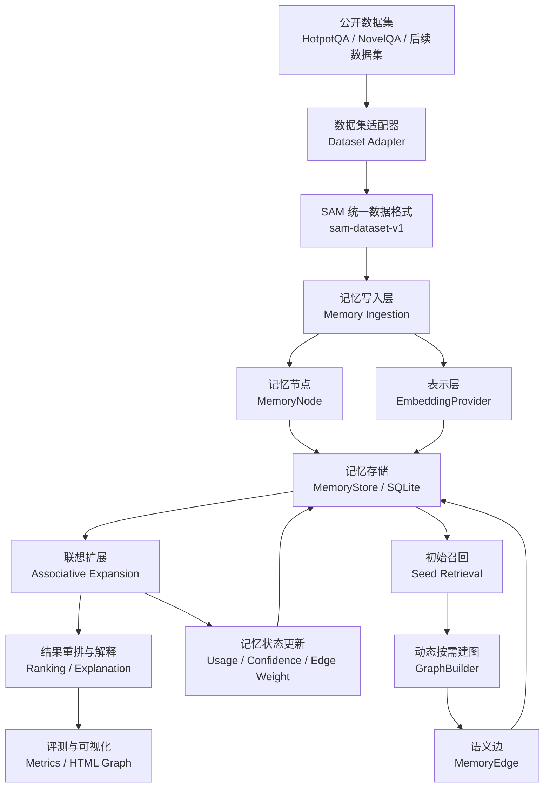
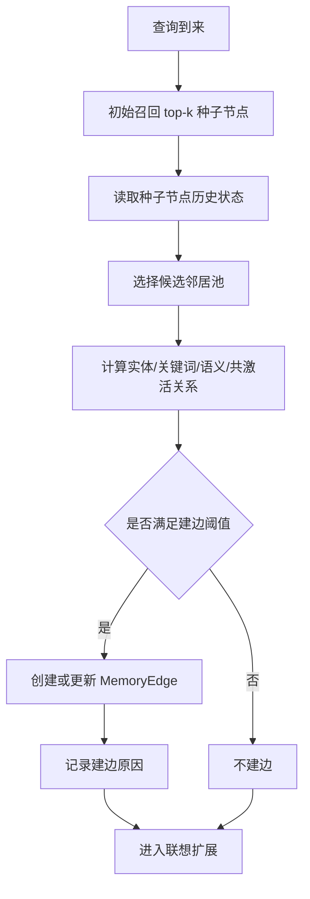
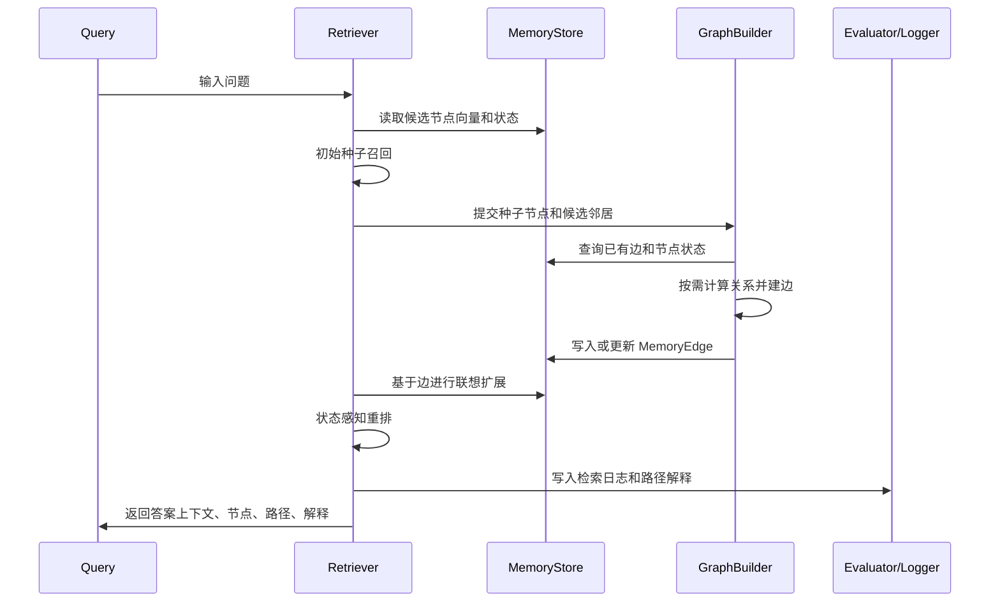

# SAM 系统设计文档

本文档用于说明硕士论文《基于语义联想机制的动态知识图谱记忆系统方法与实现》的后续项目设计。当前阶段不再把工作卡在 embedding 模型选择上，而是先把系统结构、模块边界、动态记忆机制和实验路线设计清楚。Embedding 只作为可替换基础能力接入，不影响主系统继续推进。

## 1. 项目定位

SAM 的目标不是再做一个普通 RAG demo，而是实现一个具有动态记忆演化能力的知识图谱记忆系统。传统 RAG 通常将文档切块后写入向量库，查询时直接按 query-document 语义相似度取 top-k。这个流程简单，但在多跳问答、长文本阅读和跨文档推理中容易出现两个问题：

- 证据链断裂：某个关键证据和用户问题并不直接相似，只和另一个已命中证据相关。
- 记忆状态静态：系统不会根据历史访问、使用频率和上下文激活情况调整记忆结构。

SAM 希望解决的是第二层问题：系统不只检索文本，还要形成可解释、可更新、可追踪的记忆网络。

## 2. 核心思想

SAM 将知识表示为动态记忆图：

- 记忆节点：表示一段文档、一个段落、一个小说 chunk 或一个中间摘要。
- 语义边：表示两个记忆节点之间的实体共现、关键词重叠、语义相似、历史共激活或任务反馈关系。
- 检索激活：一次查询会先激活少量种子节点，再沿图进行联想扩展。
- 按需建图：不是一开始全量两两建边，而是在节点被访问、被命中或被共同激活时逐步补充边。
- 状态更新：每次检索都会更新节点使用次数、访问时间、置信度和边权。

这使 SAM 和 GraphRAG、RAPTOR、HippoRAG 的区别更清楚：

| 方法 | 核心特征 | 结构是否动态 | SAM 对比点 |
| --- | --- | --- | --- |
| 向量检索 | query-document 相似度 top-k | 否 | SAM 增加图联想和状态更新 |
| RAPTOR | 递归聚类与摘要树 | 主要静态 | SAM 不只依赖摘要层级，而是围绕访问动态建边 |
| GraphRAG | 实体图和社区摘要 | 主要静态 | SAM 强调检索过程中的记忆演化 |
| HippoRAG | KG 激活和 PPR 传播 | 图结构多为预构建 | SAM 的边和权重会随使用变化 |
| SAM | 按需图构建、联想检索、记忆状态 | 是 | 论文主方法 |

## 3. 总体架构



## 4. 模块设计

### 4.1 Dataset Adapter

不同公开数据集的原始格式差异很大，因此系统不应该围绕 HotpotQA 或 NovelQA 的字段写死。所有外部数据集必须先转换成 `sam-dataset-v1`。

统一格式中的核心对象：

- `documents`：候选记忆文档，每个 document 可以来自 Wikipedia 段落、小说 chunk、论文段落等。
- `queries`：评测问题，包含问题文本、标准答案、支持证据和数据集特有 metadata。
- `dataset_info`：记录数据集名称、来源、版本、license 或下载说明。
- `processing`：记录转换脚本、切分策略、样本数量等，保证实验可复现。

后续新增数据集时，只需要新增一个专门处理脚本，例如：

```text
scripts/prepare_xxx.py -> data/processed/xxx_sam_sample.json
```

核心检索系统只读取统一格式，不直接读取原始数据集。

### 4.2 MemoryNode

记忆节点是系统的最小可检索单元。当前设计字段包括：

| 字段 | 含义 |
| --- | --- |
| `id` | 系统内部节点 ID |
| `source_id` | 原始数据集中的文档或 chunk ID |
| `title` | 可选标题，不要求所有数据集都有 |
| `text` | 节点正文 |
| `summary` | 可选摘要，后续可由 LLM 或抽取式方法生成 |
| `keywords` | 关键词或实体短语 |
| `source` | 数据来源，例如 HotpotQA、NovelQA |
| `timestamp` | 写入时间 |
| `usage_count` | 节点被检索或扩展命中的次数 |
| `confidence` | 节点可信度或任务相关置信度 |
| `embedding` | 可替换表示向量 |

重要设计点：`title` 只是可选展示字段，不作为系统通用假设。对于 NovelQA，标题可以是小说名和 chunk 编号；对于论文数据，标题可以是章节名；没有标题的数据集也可以正常运行。

### 4.3 MemoryEdge

语义边用于解释两个节点为何产生联想关系。边不是抽象黑盒相似度，而是带有类型和创建原因。

| 字段 | 含义 |
| --- | --- |
| `source_node_id` | 起点节点 |
| `target_node_id` | 终点节点 |
| `relation_type` | 关系类型 |
| `weight` | 边权 |
| `reason` | 建边原因 |
| `created_by` | 建边模块 |
| `created_at` | 创建时间 |
| `last_activated_at` | 最近激活时间 |

当前可支持的关系类型：

- `semantic_similarity`：文本语义相似。
- `entity_overlap`：实体或专名重叠。
- `keyword_overlap`：关键词重叠。
- `co_activation`：两个节点在同一次检索中共同出现。
- `feedback_strengthened`：用户反馈或任务结果强化。
- `summary_parent`：摘要节点和原始 chunk 的层级关系。

### 4.4 EmbeddingProvider

Embedding 暂时不是主线阻塞点。系统只要求它满足统一接口：

```text
embed_text(text) -> vector
embed_batch(texts) -> vectors
```

后续可以接入多种实现：

- `HashEmbeddingProvider`：无依赖 smoke test，保证流程能跑。
- `LocalSentenceTransformerProvider`：本地模型，例如 Qwen3-Embedding、BGE、E5。
- `OpenAICompatibleEmbeddingProvider`：公司或云端 OpenAI-compatible embedding API。
- `HFInferenceEmbeddingProvider`：Hugging Face 在线 feature extraction。

论文实现上，EmbeddingProvider 是基础表示模块，不是 SAM 的核心创新点。SAM 的创新点放在动态建图、记忆状态更新和联想检索机制上。

### 4.5 GraphBuilder

GraphBuilder 负责按需建图。它不在数据写入时做全量两两比较，而是在以下场景触发建边：

- 新节点被多次访问。
- 查询命中某个种子节点。
- 两个节点在一次检索中共同出现在候选集中。
- 节点被评测证明包含支持证据。
- 用户或系统反馈某条路径有用。

按需建图流程：



这样可以直接回应开题专家担心的建图时间成本：SAM 不追求全量图，而是让图结构随访问逐步成长。

### 4.6 Retriever

SAM 检索不是单步 top-k，而是多阶段过程：

1. 查询理解：抽取查询关键词、实体、任务类型。
2. 种子召回：用 embedding 或其他轻量方式找到初始候选。
3. 按需建图：围绕种子节点补充或更新边。
4. 联想扩展：沿高权重边扩展一跳或两跳。
5. 状态感知重排：综合相似度、路径权重、使用频率、置信度和时间因素。
6. 解释输出：返回命中节点、扩展路径、边类型和排序依据。
7. 记忆更新：写入访问日志，更新节点和边的状态。

最终输出不只是文档列表，而是：

```text
query -> seed nodes -> activated edges -> expanded nodes -> ranked results -> explanation paths
```

### 4.7 Evaluator

评测模块分两层：

第一层是 SAM 自身可控评测：

- evidence recall
- answer hit
- supporting document hit count
- path length
- activated edge count
- new useful evidence from expansion

第二层是官方 baseline 评测：

- RAPTOR 官方实现。
- Microsoft GraphRAG 官方实现。
- HippoRAG 官方实现。

短期先保证 SAM 自身实验闭环完整；官方 baseline 因依赖和 API 成本较高，可以作为后续增强实验。

## 5. SAM 检索流程详解



## 6. 动态记忆更新机制

SAM 的“动态”不应该只停留在口头上，需要在代码和运行产物中可检查。后续实现时，每次检索至少更新以下内容：

- `usage_count += 1`：被命中的节点使用次数增加。
- `last_accessed_at`：记录最近访问时间。
- `edge.activation_count += 1`：被走过的边激活次数增加。
- `edge.weight`：共同命中或证据有效时增强。
- `retrieval_log`：记录本次查询的种子、扩展路径、最终结果。

边权更新可以先采用简单公式：

```text
new_weight = old_weight * decay + relation_score * alpha + feedback_score * beta
```

其中：

- `decay` 控制历史边权衰减。
- `relation_score` 来自实体、关键词或语义关系。
- `feedback_score` 来自答案命中或证据命中。

先实现这个基础版本，后续再加入更复杂的学习式权重更新。

## 7. 可解释性设计

用户必须能看懂 SAM 为什么选这些节点。每条结果至少提供：

- 节点文本和来源。
- 节点是否是初始种子。
- 节点是否由图扩展得到。
- 从哪个种子节点扩展而来。
- 经过哪些边。
- 每条边的关系类型和建边原因。
- 最终排序分数构成。

HTML 可视化应重点展示：

- 同一问题下不同方法的图结构对比。
- 节点点击查看完整文本和 MemoryNode 状态。
- 边点击查看 relation type、weight、reason。
- 右侧固定区域展示不同方法共同命中的节点。
- 显示问题、标准答案、各方法答案和证据命中状态。

## 8. 后续开发优先级

当前优先级不再是 embedding，而是让 SAM 主方法更像一个真正的动态记忆系统。

### P0：把动态记忆状态做实

目标：每跑一次 query，数据库中的节点和边状态真的发生变化。

任务：

- 为 MemoryNode 增加 `last_accessed_at`。
- 为 MemoryEdge 增加 `activation_count` 和 `last_activated_at`。
- 检索后写入 retrieval log。
- HTML 中展示节点使用次数、边激活次数和最近访问时间。

验收：

- 连续查询同一个问题，相关节点 `usage_count` 增加。
- 图上边权或激活次数变化可见。
- `cases.json` 能解释状态变化。

### P1：实现更清晰的按需建图策略

目标：把“为什么建这条边”变成可审计产物。

任务：

- 将建边拆成多个 scorer：实体、关键词、语义、共激活。
- 每条边保存 score breakdown。
- 设置不同关系类型的阈值。
- 限制每个种子节点最大新增边数，控制成本。

验收：

- HTML 点击边能看到具体建边原因。
- run 目录中输出 `edge_creation_log.json`。
- 可以统计每次 query 新建了多少条边。

### P2：把 SAM 检索和传统检索差异拉大

目标：SAM 不再只是“向量召回加一跳扩展”。

已完成初版：

- 引入多路径激活：同一节点可累积来自多条候选路径的支持信号。
- 引入记忆状态：节点使用次数、近期访问状态和边历史激活会进入排序分数。
- 输出分数分解：每个 SAM 命中结果记录相似度、图分、路径支持、边记忆、使用频率、近期访问和置信度分量。

后续任务：

- 支持两跳扩展，但用 beam size 控制搜索成本。
- 对使用频率和时间衰减参数进行更系统的消融实验。
- 将多路径激活与摘要层级节点结合。

验收：

- 输出每个结果的分数分解。
- 能看到某些节点不是 top-k 种子，但通过路径被补回。
- 评测中统计 `新增有效证据数`。

### P3：完善实验与论文材料

目标：中期和毕业论文都能直接引用结果。

已完成初版：

- 新增 `sam_full`、`sam_no_multipath`、`sam_no_memory_state`、`sam_no_graph`、`sam_static_graph` 五种消融检索模式。
- 固定 HotpotQA bridge-style 300 条主实验，包含 2992 个候选文档节点和 600 个 gold supporting documents。
- 输出 `ablation_metrics.json`、`ablation_metrics.md`，记录证据召回率、答案命中率、平均路径长度、平均候选路径数、平均路径支持分和平均边记忆分。
- 将按需建图限制在当前查询候选记忆范围内，并对节点、边和检索日志写入做批量化与轻量化处理，使 300 条实验可以稳定跑通。

后续任务：

- 固定 HotpotQA 300 条消融实验和 NovelQA demonstration 样本。
- 每次实验输出完整 config、metrics、cases、graphs。
- 生成 `docs/experiment_protocol.md`。
- 生成 `docs/thesis_method_notes.md`，整理方法章节素材。

验收：

- 一条命令重现实验。
- README 只放入口说明，详细实验协议放 docs。
- 中期总结可以真实写“已完成动态记忆原型与可解释实验产物”。

### P4：消融实验设计

当前消融实验用于说明 SAM 内部模块分别贡献了什么：

| 方法 | 开关含义 | 观察重点 |
| --- | --- | --- |
| `sam_full` | 完整 SAM，启用图扩展、多路径、记忆状态和动态更新 | 主方法效果 |
| `sam_no_multipath` | 关闭多路径累积，只保留单条最佳路径 | 多路径是否提升证据召回 |
| `sam_no_memory_state` | 不使用 usage、recency、edge activation 分数 | 动态记忆状态是否影响排序 |
| `sam_no_graph` | 不进行图扩展，只保留初始召回和状态分 | 图联想是否补回间接证据 |
| `sam_static_graph` | 使用已有图，但检索后不更新动态状态 | 动态更新和历史边激活的影响 |

从 300 条 HotpotQA 实验看，`sam_full` 相比 Embedding Top-k 多命中 12 个支持证据，答案命中率从 0.547 提升到 0.577。`sam_no_graph` 的平均路径长度为 1.00，答案命中率回落到 0.557，说明图扩展对多跳问答中的间接证据补充有实际作用。`sam_full` 与 `sam_no_multipath`、`sam_no_memory_state` 的差异相对较小，说明下一阶段需要继续优化多路径重排权重、记忆状态衰减函数和 embedding 表示质量。

## 9. 两周推进建议

```text
第 1-2 天：动态状态字段与检索日志
第 3-4 天：按需建图 scorer 拆分与边解释
第 5-6 天：SAM 状态感知重排与路径分数
第 7 天：HTML 可视化升级
第 8-9 天：HotpotQA / NovelQA 小样本实验
第 10 天：整理实验报告和中期材料
第 11-14 天：修 bug、补测试、准备论文方法章节
```

## 10. 当前决策

为了避免继续被模型依赖阻塞，当前阶段采用以下决策：

- EmbeddingProvider 保持可替换接口。
- 默认实验仍可用轻量本地表示跑通。
- 后续再接 Qwen3-Embedding、BGE 或公司 embedding 服务。
- 主线开发优先放在动态记忆图、检索日志、路径解释和可视化上。

这个决策不会削弱论文方向。相反，它能让项目更快形成可展示的系统贡献：不是“用了哪个 embedding 模型”，而是“设计并实现了一个会随使用演化的语义联想记忆系统”。
