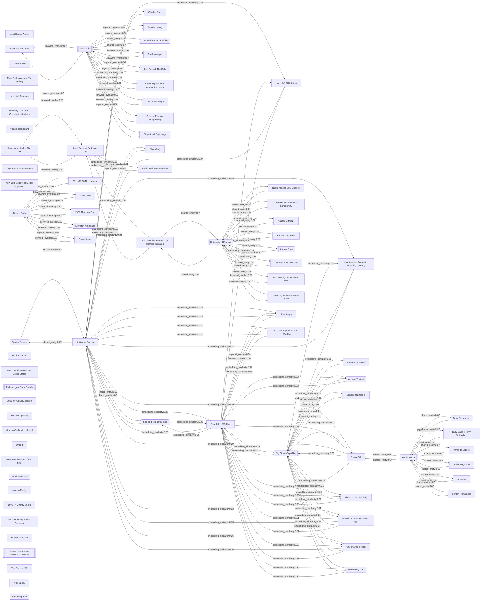

# SAM 图谱 Mermaid 视图

```mermaid
flowchart LR
  mem_7697eee384354e3c["Meet Corliss Archer"]
  mem_370b7d4347cb0f81[["Shirley Temple"]]
  mem_cec121b756527cbf["Janet Waldo"]
  mem_dd863f77686c5735["Meet Corliss Archer (TV series)"]
  mem_c81341af11a17181["Lord High Treasurer"]
  mem_9f7764d494133890["A Kiss for Corliss"]
  mem_adb30998bce56b07[["Kiss and Tell (1945 film)"]]
  mem_236a29fc42a5c901["Secretary of State for Constitutional Affairs"]
  mem_33cd4ff14a833509["Village accountant"]
  mem_b63c9f3723ed1280["Charles Craft"]
  mem_6d22c4d45f4f056d["Andre Norton Award"]
  mem_e19df01c6024a4d1["Victoria Hanley"]
  mem_b8f53dd338c85457[["The Hork-Bajir Chronicles"]]
  mem_7327c914e527a97c["Shadowshaper"]
  mem_162119eecfdf2adf["Left Behind: The Kids"]
  mem_90df9dfc89321615["List of Square Enix companion books"]
  mem_55f8704c5c789d6e["The Divide trilogy"]
  mem_d2aff5afccf117fc["Science Fantasy (magazine)"]
  mem_72009a704fd2cc0a[["Animorphs"]]
  mem_cc891bfccc0690a5["Etiquette &amp; Espionage"]
  mem_02223dfe801f5e84["Just Another Romantic Wrestling Comedy"]
  mem_8079a4a72a813264["Kingston Morning"]
  mem_28b5e8e4b3772366["Nola (film)"]
  mem_36dabff8cb904650[["Adriana Trigiani"]]
  mem_7288adde613407c1["Great Eastern Conventions"]
  mem_a69606911ee90198["New York Society of Model Engineers"]
  mem_b83f975c32430a1e["Clinton, Minnesota"]
  mem_537a6261fb5f9dc7["Hamish and Andy's Gap Year"]
  mem_5ae933a231af39a0["I Love NY (2015 film)"]
  mem_3ede339a42fdd773[["Big Stone Gap (film)"]]
  mem_4ceae82d95b7f531["Billings Bulls"]
  mem_53b32cb2d1ce07a3["Robins Center"]
  mem_ec8e6a7a7210de4b["2011–12 QMJHL season"]
  mem_6d468a03bed9a16a["Loan modification in the United States"]
  mem_f74767a19e693588["Case Gym"]
  mem_f4d20f0ec12aff2a[["Androscoggin Bank Colisée"]]
  mem_6aff071c8cdc8835["2007 Memorial Cup"]
  mem_6b885c37ddbd517b[["Lewiston Maineiacs"]]
  mem_a9e78f51bbf34d88["Dwyer Arena"]
  mem_23dee32cc943fb68["2006–07 QMJHL season"]
  mem_7f496efdb1d7f3b5[["Annie Morton"]]
  mem_39d7af1f111d5b90["Madonna (book)"]
  mem_35a69d78ac155552[["Terry Richardson"]]
  mem_93518e8c9d6185ca["Lady Gaga x Terry Richardson"]
  mem_6d02e64f0e07d876["Gumbo (PJ Morton album)"]
  mem_ab04251d44e05b46["Amanda Lepore"]
  mem_5a047797c957442b["Piano Girl"]
  mem_7fa5b51e53ab6d48["Index Magazine"]
  mem_2b334963048c007e["Snoecks"]
  mem_506385d5a587512d["Kenton Richardson"]
  mem_c72ff37922f876d1["North Kansas City, Missouri"]
  mem_fc7ceda99822a9c4["University of Missouri–Kansas City"]
  mem_66cd87315fc13282["Kansas City jazz"]
  mem_6e677d93fcdc31c9["Kansas City Scout"]
  mem_eab44424e87bdaff[["Kansas Song"]]
  mem_d141481d8de8a91a["Downtown Kansas City"]
  mem_1fcc9458ae962c86["Kansas City metropolitan area"]
  mem_bbeeacb84b2de46a["University of the Incarnate Word"]
  mem_8bdbdca8a3ec7362["History of the Kansas City metropolitan area"]
  mem_a1b72eb596ed5980[["University of Kansas"]]
  mem_ec0a328179f6c2b2["Ungod"]
  mem_5d3bab9d2772f419["Season of the Witch (2011 film)"]
  mem_904b0758d46c0f41["Time to Kill (1989 film)"]
  mem_1a233b5d2c8e1f60[["David Weissman"]]
  mem_3205f471d2bf81cb["Deadfall (1993 film)"]
  mem_b2d0baffaf5aaba2["Gone in 60 Seconds (2000 film)"]
  mem_75a1eb162396d2fd["Drive Angry"]
  mem_c8b77d88da839a54["It Could Happen to You (1994 film)"]
  mem_9c972d0e05d069ff["City of Angels (film)"]
  mem_7beec65962141142[["The Family Man"]]
  mem_82b36ad67d78dabb["Joshua Parlby"]
  mem_f6a2f5acb2a949d4["1996 FA Charity Shield"]
  mem_7010b4fdb2c3b7fe["Sir Matt Busby Sports Complex"]
  mem_86af338e81fe6f91["Ernest Mangnall"]
  mem_3190e94565b6750e["David Beckham Academy"]
  mem_cad350d902806193[["1995–96 Manchester United F.C. season"]]
  mem_eda02b77d7ecea3b["The Class of '92"]
  mem_304ea0fca865a016["David Beckham's Soccer USA"]
  mem_7cd439bb8dfb40f6["Matt Busby"]
  mem_d83bc07a63b2d628[["Alex Ferguson"]]
  mem_9f7764d494133890 -- "shared_entity:0.67" --> mem_370b7d4347cb0f81
  mem_370b7d4347cb0f81 -- "shared_entity:0.67" --> mem_9f7764d494133890
  mem_9f7764d494133890 -- "shared_entity:0.67" --> mem_adb30998bce56b07
  mem_adb30998bce56b07 -- "shared_entity:0.67" --> mem_9f7764d494133890
  mem_9f7764d494133890 -- "embedding_similarity:0.26" --> mem_b63c9f3723ed1280
  mem_b63c9f3723ed1280 -- "embedding_similarity:0.26" --> mem_9f7764d494133890
  mem_9f7764d494133890 -- "embedding_similarity:0.23" --> mem_02223dfe801f5e84
  mem_02223dfe801f5e84 -- "embedding_similarity:0.23" --> mem_9f7764d494133890
  mem_9f7764d494133890 -- "embedding_similarity:0.22" --> mem_28b5e8e4b3772366
  mem_28b5e8e4b3772366 -- "embedding_similarity:0.22" --> mem_9f7764d494133890
  mem_9f7764d494133890 -- "embedding_similarity:0.27" --> mem_5ae933a231af39a0
  mem_5ae933a231af39a0 -- "embedding_similarity:0.27" --> mem_9f7764d494133890
  mem_9f7764d494133890 -- "embedding_similarity:0.29" --> mem_5a047797c957442b
  mem_5a047797c957442b -- "embedding_similarity:0.29" --> mem_9f7764d494133890
  mem_9f7764d494133890 -- "embedding_similarity:0.28" --> mem_3205f471d2bf81cb
  mem_3205f471d2bf81cb -- "embedding_similarity:0.28" --> mem_9f7764d494133890
  mem_9f7764d494133890 -- "embedding_similarity:0.23" --> mem_b2d0baffaf5aaba2
  mem_b2d0baffaf5aaba2 -- "embedding_similarity:0.23" --> mem_9f7764d494133890
  mem_9f7764d494133890 -- "embedding_similarity:0.26" --> mem_75a1eb162396d2fd
  mem_75a1eb162396d2fd -- "embedding_similarity:0.26" --> mem_9f7764d494133890
  mem_9f7764d494133890 -- "embedding_similarity:0.20" --> mem_c8b77d88da839a54
  mem_c8b77d88da839a54 -- "embedding_similarity:0.20" --> mem_9f7764d494133890
  mem_9f7764d494133890 -- "embedding_similarity:0.26" --> mem_9c972d0e05d069ff
  mem_9c972d0e05d069ff -- "embedding_similarity:0.26" --> mem_9f7764d494133890
  mem_72009a704fd2cc0a -- "keyword_overlap:0.67" --> mem_6d22c4d45f4f056d
  mem_6d22c4d45f4f056d -- "keyword_overlap:0.67" --> mem_72009a704fd2cc0a
  mem_72009a704fd2cc0a -- "keyword_overlap:0.51" --> mem_e19df01c6024a4d1
  mem_e19df01c6024a4d1 -- "keyword_overlap:0.51" --> mem_72009a704fd2cc0a
  mem_72009a704fd2cc0a -- "shared_entity:0.67" --> mem_b8f53dd338c85457
  mem_b8f53dd338c85457 -- "shared_entity:0.67" --> mem_72009a704fd2cc0a
  mem_72009a704fd2cc0a -- "keyword_overlap:0.67" --> mem_7327c914e527a97c
  mem_7327c914e527a97c -- "keyword_overlap:0.67" --> mem_72009a704fd2cc0a
  mem_72009a704fd2cc0a -- "keyword_overlap:0.51" --> mem_162119eecfdf2adf
  mem_162119eecfdf2adf -- "keyword_overlap:0.51" --> mem_72009a704fd2cc0a
  mem_72009a704fd2cc0a -- "embedding_similarity:0.28" --> mem_90df9dfc89321615
  mem_90df9dfc89321615 -- "embedding_similarity:0.28" --> mem_72009a704fd2cc0a
  mem_72009a704fd2cc0a -- "keyword_overlap:0.59" --> mem_55f8704c5c789d6e
  mem_55f8704c5c789d6e -- "keyword_overlap:0.59" --> mem_72009a704fd2cc0a
  mem_72009a704fd2cc0a -- "keyword_overlap:0.51" --> mem_d2aff5afccf117fc
  mem_d2aff5afccf117fc -- "keyword_overlap:0.51" --> mem_72009a704fd2cc0a
  mem_72009a704fd2cc0a -- "keyword_overlap:0.51" --> mem_cc891bfccc0690a5
  mem_cc891bfccc0690a5 -- "keyword_overlap:0.51" --> mem_72009a704fd2cc0a
  mem_3ede339a42fdd773 -- "embedding_similarity:0.26" --> mem_02223dfe801f5e84
  mem_02223dfe801f5e84 -- "embedding_similarity:0.26" --> mem_3ede339a42fdd773
  mem_3ede339a42fdd773 -- "embedding_similarity:0.23" --> mem_8079a4a72a813264
  mem_8079a4a72a813264 -- "embedding_similarity:0.23" --> mem_3ede339a42fdd773
  mem_3ede339a42fdd773 -- "shared_entity:0.67" --> mem_36dabff8cb904650
  mem_36dabff8cb904650 -- "shared_entity:0.67" --> mem_3ede339a42fdd773
  mem_3ede339a42fdd773 -- "keyword_overlap:0.51" --> mem_b83f975c32430a1e
  mem_b83f975c32430a1e -- "keyword_overlap:0.51" --> mem_3ede339a42fdd773
  mem_3ede339a42fdd773 -- "embedding_similarity:0.31" --> mem_5a047797c957442b
  mem_5a047797c957442b -- "embedding_similarity:0.31" --> mem_3ede339a42fdd773
  mem_3ede339a42fdd773 -- "embedding_similarity:0.21" --> mem_904b0758d46c0f41
  mem_904b0758d46c0f41 -- "embedding_similarity:0.21" --> mem_3ede339a42fdd773
  mem_3ede339a42fdd773 -- "embedding_similarity:0.26" --> mem_3205f471d2bf81cb
  mem_3205f471d2bf81cb -- "embedding_similarity:0.26" --> mem_3ede339a42fdd773
  mem_3ede339a42fdd773 -- "embedding_similarity:0.29" --> mem_b2d0baffaf5aaba2
  mem_b2d0baffaf5aaba2 -- "embedding_similarity:0.29" --> mem_3ede339a42fdd773
  mem_3ede339a42fdd773 -- "embedding_similarity:0.21" --> mem_9c972d0e05d069ff
  mem_9c972d0e05d069ff -- "embedding_similarity:0.21" --> mem_3ede339a42fdd773
  mem_3ede339a42fdd773 -- "embedding_similarity:0.32" --> mem_7beec65962141142
  mem_7beec65962141142 -- "embedding_similarity:0.32" --> mem_3ede339a42fdd773
  mem_4ceae82d95b7f531 -- "keyword_overlap:0.51" --> mem_ec8e6a7a7210de4b
  mem_ec8e6a7a7210de4b -- "keyword_overlap:0.51" --> mem_4ceae82d95b7f531
  mem_4ceae82d95b7f531 -- "keyword_overlap:0.59" --> mem_f74767a19e693588
  mem_f74767a19e693588 -- "keyword_overlap:0.59" --> mem_4ceae82d95b7f531
  mem_4ceae82d95b7f531 -- "keyword_overlap:0.51" --> mem_6aff071c8cdc8835
  mem_6aff071c8cdc8835 -- "keyword_overlap:0.51" --> mem_4ceae82d95b7f531
  mem_4ceae82d95b7f531 -- "keyword_overlap:0.59" --> mem_6b885c37ddbd517b
  mem_6b885c37ddbd517b -- "keyword_overlap:0.59" --> mem_4ceae82d95b7f531
  mem_4ceae82d95b7f531 -- "keyword_overlap:0.59" --> mem_a9e78f51bbf34d88
  mem_a9e78f51bbf34d88 -- "keyword_overlap:0.59" --> mem_4ceae82d95b7f531
  mem_7f496efdb1d7f3b5 -- "shared_entity:0.67" --> mem_35a69d78ac155552
  mem_35a69d78ac155552 -- "shared_entity:0.67" --> mem_7f496efdb1d7f3b5
  mem_7f496efdb1d7f3b5 -- "shared_entity:0.67" --> mem_93518e8c9d6185ca
  mem_93518e8c9d6185ca -- "shared_entity:0.67" --> mem_7f496efdb1d7f3b5
  mem_7f496efdb1d7f3b5 -- "shared_entity:0.67" --> mem_ab04251d44e05b46
  mem_ab04251d44e05b46 -- "shared_entity:0.67" --> mem_7f496efdb1d7f3b5
  mem_7f496efdb1d7f3b5 -- "shared_entity:0.67" --> mem_5a047797c957442b
  mem_5a047797c957442b -- "shared_entity:0.67" --> mem_7f496efdb1d7f3b5
  mem_7f496efdb1d7f3b5 -- "shared_entity:0.67" --> mem_7fa5b51e53ab6d48
  mem_7fa5b51e53ab6d48 -- "shared_entity:0.67" --> mem_7f496efdb1d7f3b5
  mem_7f496efdb1d7f3b5 -- "shared_entity:0.67" --> mem_2b334963048c007e
  mem_2b334963048c007e -- "shared_entity:0.67" --> mem_7f496efdb1d7f3b5
  mem_7f496efdb1d7f3b5 -- "shared_entity:0.67" --> mem_506385d5a587512d
  mem_506385d5a587512d -- "shared_entity:0.67" --> mem_7f496efdb1d7f3b5
  mem_a1b72eb596ed5980 -- "shared_entity:0.67" --> mem_c72ff37922f876d1
  mem_c72ff37922f876d1 -- "shared_entity:0.67" --> mem_a1b72eb596ed5980
  mem_a1b72eb596ed5980 -- "shared_entity:0.67" --> mem_fc7ceda99822a9c4
  mem_fc7ceda99822a9c4 -- "shared_entity:0.67" --> mem_a1b72eb596ed5980
  mem_a1b72eb596ed5980 -- "shared_entity:0.67" --> mem_66cd87315fc13282
  mem_66cd87315fc13282 -- "shared_entity:0.67" --> mem_a1b72eb596ed5980
  mem_a1b72eb596ed5980 -- "shared_entity:0.67" --> mem_6e677d93fcdc31c9
  mem_6e677d93fcdc31c9 -- "shared_entity:0.67" --> mem_a1b72eb596ed5980
  mem_a1b72eb596ed5980 -- "shared_entity:0.67" --> mem_eab44424e87bdaff
  mem_eab44424e87bdaff -- "shared_entity:0.67" --> mem_a1b72eb596ed5980
  mem_a1b72eb596ed5980 -- "shared_entity:0.67" --> mem_d141481d8de8a91a
  mem_d141481d8de8a91a -- "shared_entity:0.67" --> mem_a1b72eb596ed5980
  mem_a1b72eb596ed5980 -- "shared_entity:0.67" --> mem_1fcc9458ae962c86
  mem_1fcc9458ae962c86 -- "shared_entity:0.67" --> mem_a1b72eb596ed5980
  mem_a1b72eb596ed5980 -- "keyword_overlap:0.51" --> mem_bbeeacb84b2de46a
  mem_bbeeacb84b2de46a -- "keyword_overlap:0.51" --> mem_a1b72eb596ed5980
  mem_a1b72eb596ed5980 -- "shared_entity:0.67" --> mem_8bdbdca8a3ec7362
  mem_8bdbdca8a3ec7362 -- "shared_entity:0.67" --> mem_a1b72eb596ed5980
  mem_3205f471d2bf81cb -- "embedding_similarity:0.26" --> mem_adb30998bce56b07
  mem_adb30998bce56b07 -- "embedding_similarity:0.26" --> mem_3205f471d2bf81cb
  mem_3205f471d2bf81cb -- "embedding_similarity:0.24" --> mem_36dabff8cb904650
  mem_36dabff8cb904650 -- "embedding_similarity:0.24" --> mem_3205f471d2bf81cb
  mem_3205f471d2bf81cb -- "embedding_similarity:0.20" --> mem_5ae933a231af39a0
  mem_5ae933a231af39a0 -- "embedding_similarity:0.20" --> mem_3205f471d2bf81cb
  mem_3205f471d2bf81cb -- "embedding_similarity:0.27" --> mem_5a047797c957442b
  mem_5a047797c957442b -- "embedding_similarity:0.27" --> mem_3205f471d2bf81cb
  mem_3205f471d2bf81cb -- "embedding_similarity:0.25" --> mem_904b0758d46c0f41
  mem_904b0758d46c0f41 -- "embedding_similarity:0.25" --> mem_3205f471d2bf81cb
  mem_3205f471d2bf81cb -- "embedding_similarity:0.31" --> mem_b2d0baffaf5aaba2
  mem_b2d0baffaf5aaba2 -- "embedding_similarity:0.31" --> mem_3205f471d2bf81cb
  mem_3205f471d2bf81cb -- "keyword_overlap:0.51" --> mem_75a1eb162396d2fd
  mem_75a1eb162396d2fd -- "keyword_overlap:0.51" --> mem_3205f471d2bf81cb
  mem_3205f471d2bf81cb -- "embedding_similarity:0.34" --> mem_c8b77d88da839a54
  mem_c8b77d88da839a54 -- "embedding_similarity:0.34" --> mem_3205f471d2bf81cb
  mem_3205f471d2bf81cb -- "embedding_similarity:0.28" --> mem_9c972d0e05d069ff
  mem_9c972d0e05d069ff -- "embedding_similarity:0.28" --> mem_3205f471d2bf81cb
  mem_3205f471d2bf81cb -- "embedding_similarity:0.30" --> mem_7beec65962141142
  mem_7beec65962141142 -- "embedding_similarity:0.30" --> mem_3205f471d2bf81cb
  mem_304ea0fca865a016 -- "keyword_overlap:0.51" --> mem_537a6261fb5f9dc7
  mem_537a6261fb5f9dc7 -- "keyword_overlap:0.51" --> mem_304ea0fca865a016
  mem_304ea0fca865a016 -- "embedding_similarity:0.23" --> mem_8bdbdca8a3ec7362
  mem_8bdbdca8a3ec7362 -- "embedding_similarity:0.23" --> mem_304ea0fca865a016
  mem_304ea0fca865a016 -- "keyword_overlap:0.51" --> mem_3190e94565b6750e
  mem_3190e94565b6750e -- "keyword_overlap:0.51" --> mem_304ea0fca865a016
```